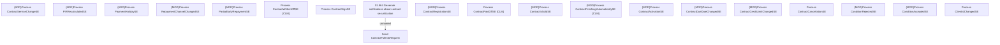

# Business Rules

```mermaid
graph TD
    ADD_Process_ContractServiceChangeSE["{ADD}Process ContractServiceChangeSE"]
    ADD_Process_PIRRecalculatedSE["{ADD}Process PIRRecalculatedSE"]
    ADD_Process_PaymentHolidaySE["{ADD}Process PaymentHolidaySE"]
    MOD_Process_RepaymentChannelChangedSE["{MOD}Process RepaymentChannelChangedSE"]
    MOD_Process_PartialEarlyRepaymentSE["{MOD}Process PartialEarlyRepaymentSE"]
    Process_ContractWrittenOffSE_CLM["Process ContractWrittenOffSE [CLM]"]
    Process_ContractSignSE["Process ContractSignSE"]
    n_01_864_Generate_notifications_about_contract_securitizatio["01.864 Generate notifications about contract securitization"]
    MOD_Process_ContractRegistrationSE["{MOD}Process ContractRegistrationSE"]
    Process_ContractPaidOffSE_CLM["Process ContractPaidOffSE [CLM] "]
    MOD_Process_ContractIsSoldSE["{MOD}Process ContractIsSoldSE"]
    MOD_Process_ContractFinishingAutomaticallySE_CLM["{MOD}Process ContractFinishingAutomaticallySE [CLM]"]
    MOD_Process_ContractActivationSE["{MOD}Process ContractActivationSE"]
    MOD_Process_ContractDueDateChangedSE["{MOD}Process ContractDueDateChangedSE"]
    MOD_Process_ContractCreditLimitChangedSE["{MOD}Process ContractCreditLimitChangedSE"]
    Process_ContractCancellationSE["Process ContractCancellationSE"]
    MOD_Process_ConditionRejectedSE["{MOD}Process ConditionRejectedSE"]
    MOD_Process_ConditionAcceptedSE["{MOD}Process ConditionAcceptedSE"]
    Send_ContractFullInfoRequest["Send ContractFullInfoRequest"]
    Process_ClientIdChangedSE["Process ClientIdChangedSE"]
    n_01_864_Generate_notifications_about_contract_securitizatio -->|unnamed| Send_ContractFullInfoRequest
```
