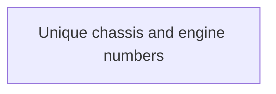

# Common Validation Rules for Contract Management

- **Diagram Type**: Custom
- **Package**: HomerSelect/BSL/Analysis Model/Contract Management/COMMON for Contract Management/Validation Rules
- **Diagram ID**: 152616
- **Elements**: 1
- **Connectors**: 0

