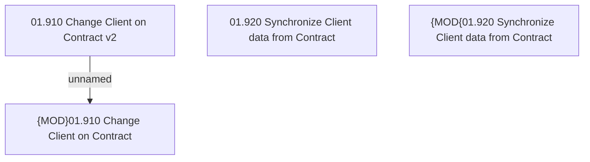

# Access Rights

```mermaid
graph TD
    n_01_910_Change_Client_on_Contract_v2["01.910 Change Client on Contract v2"]
    n_01_920_Synchronize_Client_data_from_Contract["01.920 Synchronize Client data from Contract"]
    MOD_01_910_Change_Client_on_Contract["{MOD}01.910 Change Client on Contract"]
    MOD_01_920_Synchronize_Client_data_from_Contract["{MOD{01.920 Synchronize Client data from Contract"]
    n_01_910_Change_Client_on_Contract_v2 -->|unnamed| MOD_01_910_Change_Client_on_Contract
```
