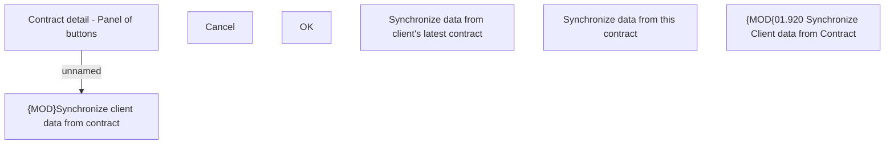

# Synchronize client data from contract

```mermaid
graph TD
    Contract_detail_Panel_of_buttons["Contract detail - Panel of buttons"]
    Cancel["Cancel"]
    OK["OK"]
    Synchronize_data_from_client_s_latest_contract["Synchronize data from client's latest contract"]
    Synchronize_data_from_this_contract["Synchronize data from this contract"]
    MOD_Synchronize_client_data_from_contract["{MOD}Synchronize client data from contract"]
    MOD_01_920_Synchronize_Client_data_from_Contract["{MOD{01.920 Synchronize Client data from Contract"]
    Contract_detail_Panel_of_buttons -->|unnamed| MOD_Synchronize_client_data_from_contract
```
