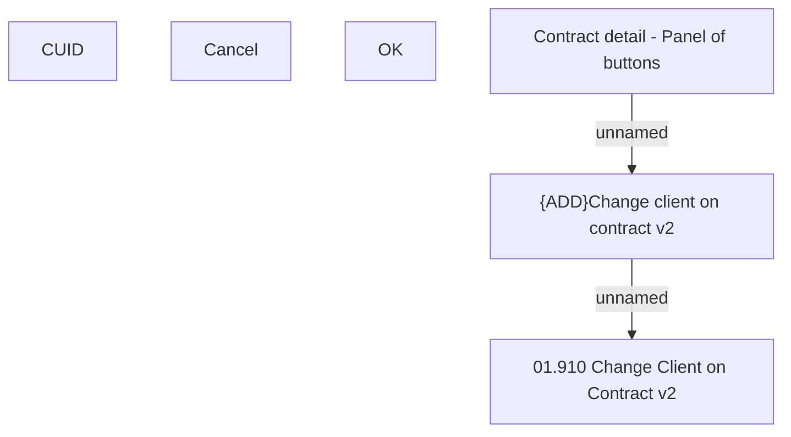

# {MOD}Change client on contract

- **Diagram Type**: Custom
- **Package**: HomerSelect/BSL/Analysis Model/Contract Management/Client on contract change/User Interface model
- **Diagram ID**: 142750
- **Elements**: 6
- **Connectors**: 2

