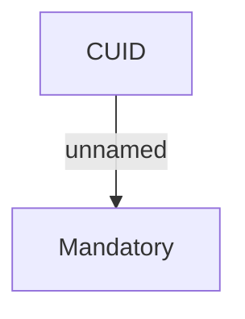

# Validation Rules

- **Diagram Type**: Custom
- **Package**: HomerSelect/BSL/Analysis Model/Contract Management/Client on contract change/Validation Rules
- **Diagram ID**: 46661
- **Elements**: 2
- **Connectors**: 1

