# Access Right

- **Diagram Type**: Custom
- **Package**: HomerSelect/BSL/Analysis Model/Contract Management/Contract API providing/Provide contract operation API/Contract DDM operations/Access Right
- **Diagram ID**: 102042
- **Elements**: 13
- **Connectors**: 7

```mermaid
graph TD
    ADD_01_781_Change_contract_DDM_status_service["{ADD}01.781 Change contract DDM status service"]
    ADD_01_781_Change_contract_DDM_status_service["{ADD}01.781 Change contract DDM status service"]
    ADD_01_780_Change_contract_repayment_channel_service["{ADD}01.780 Change contract repayment channel service"]
    n_01_780_Change_contract_repayment_channel_service["01.780 Change contract repayment channel service"]
    ADD_01_778_Cancel_contract_DDM_service_all_statuses["{ADD}01.778 Cancel contract DDM service - all statuses"]
    ADD_01_779_Get_contract_DDM_service["{ADD}01.779 Get contract DDM service"]
    ADD_01_778_Cancel_contract_DDM_service["{ADD}01.778 Cancel contract DDM service"]
    ADD_01_777_Update_contract_DDM_service["{ADD}01.777 Update contract DDM service"]
    ADD_01_776_Create_contract_DDM_service["{ADD}01.776 Create contract DDM service"]
    n_01_779_Get_contract_DDM_service["01.779 Get contract DDM service"]
    n_01_778_Cancel_contract_DDM_service["01.778 Cancel contract DDM service"]
    n_01_777_Update_contract_DDM_service["01.777 Update contract DDM service"]
    n_01_776_Create_contract_DDM_service["01.776 Create contract DDM service"]
    n_01_780_Change_contract_repayment_channel_service -->|unnamed| ADD_01_780_Change_contract_repayment_channel_service
    n_01_777_Update_contract_DDM_service -->|unnamed| ADD_01_777_Update_contract_DDM_service
    n_01_779_Get_contract_DDM_service -->|unnamed| ADD_01_779_Get_contract_DDM_service
    ADD_01_781_Change_contract_DDM_status_service -->|unnamed| ADD_01_781_Change_contract_DDM_status_service
    n_01_778_Cancel_contract_DDM_service -->|unnamed| ADD_01_778_Cancel_contract_DDM_service
    n_01_778_Cancel_contract_DDM_service -->|unnamed| ADD_01_778_Cancel_contract_DDM_service_all_statuses
    n_01_776_Create_contract_DDM_service -->|unnamed| ADD_01_776_Create_contract_DDM_service
```

