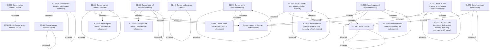

# Access Rights

```mermaid
graph TD
    ADD_01_333_Cancel_active_contract_service["{ADD}01.333 Cancel active contract service"]
    n_01_333_Cancel_active_contract_service["01.333 Cancel active contract service"]
    n_01_331_Cancel_signed_contract_with_invalid_commodity["01.331 Cancel signed contract with invalid commodity"]
    n_01_331_Cancel_signed_contract_with_invalid_commodity["01.331 Cancel signed contract with invalid commodity"]
    n_01_325_Cancel_In_Pre_Process_or_In_Process_contract_manual["01.325 Cancel In Pre-Process or In Process contract manually (In Pre-Process)"]
    n_01_325_Cancel_In_Pre_Process_or_In_Process_contract_manual["01.325 Cancel In Pre-Process or In Process contract manually (In Process)"]
    n_01_332_Cancel_signed_contract_service["01.332 Cancel signed contract service"]
    n_01_332_Cancel_signed_contract_service["01.332 Cancel signed contract service"]
    n_01_592_Cancel_paid_off_contract_manually_all_salesrooms["01.592 Cancel paid-off contract manually (all salesrooms)"]
    n_01_592_Cancel_paid_off_contract_manually["01.592 Cancel paid-off contract manually"]
    n_01_592_Cancel_paid_off_contract_manually["01.592 Cancel paid-off contract manually"]
    n_01_670_Cancel_contract_automatically["01.670 Cancel contract automatically"]
    n_01_670_Cancel_contract_automatically["01.670 Cancel contract automatically"]
    n_01_360_Cancel_contract["01.360 Cancel contract"]
    n_01_360_Cancel_contract["01.360 Cancel contract"]
    n_01_325_Cancel_In_Pre_Process_or_In_Processt_contract_manua["01.325 Cancel In Pre-Process or In Processt contract manuallty (contract in BO queue)"]
    n_01_325_Cancel_In_Pre_Process_or_In_Process_contract_manual["01.325 Cancel In Pre-Process or In Process contract manuallty (contract in FO queue)"]
    n_01_445_Cancel_undisbursed_contract["01.445 Cancel undisbursed contract"]
    n_01_325_Cancel_In_Pre_Process_or_In_Process_contract_manual["01.325 Cancel In Pre-Process or In Process contract manually (assigned to other user)"]
    n_01_590_Cancel_active_contract_manually_all_salesrooms["01.590 Cancel active contract manually (all salesrooms)"]
    n_01_590_Cancel_active_contract_manually["01.590 Cancel active contract manually"]
    n_01_330_Cancel_signed_contract_manually_all_salesrooms["01.330 Cancel signed contract manually (all salesrooms)"]
    n_01_330_Cancel_signed_contract_manually["01.330 Cancel signed contract manually"]
    n_01_325_Cancel_In_Pre_Process_or_In_Process_contract_manual["01.325 Cancel In Pre-Process or In Process contract manually (all salesrooms)"]
    n_01_325_Cancel_In_Pre_Process_or_In_Process_contract_manual["01.325 Cancel In Pre-Process or In Process contract manually"]
    n_01_320_Cancel_approved_contract_manually_all_salesrooms["01.320 Cancel approved contract manually (all salesrooms)"]
    n_01_320_Cancel_approved_contract_manually["01.320 Cancel approved contract manually"]
    n_01_340_Cancel_contract_with_generated_offers_manually_all_["01.340 Cancel contract with generated offers manually (all salesrooms)"]
    n_01_340_Cancel_contract_with_generated_offers_manually["01.340 Cancel contract with generated offers manually"]
    Access_control_to_Contract_by_Salesroom["Access control to Contract by Salesroom"]
    n_01_590_Cancel_active_contract_manually["01.590 Cancel active contract manually"]
    n_01_330_Cancel_signed_contract_manually["01.330 Cancel signed contract manually"]
    n_01_325_Cancel_In_Pre_Process_or_In_Process_contract_manual["01.325 Cancel In Pre-Process or In Process contract manually"]
    n_01_320_Cancel_approved_contract_manually["01.320 Cancel approved contract manually"]
    n_01_340_Cancel_contract_with_generated_offers_manually["01.340 Cancel contract with generated offers manually"]
    n_01_445_Cancel_undisbursed_contract["01.445 Cancel undisbursed contract"]
    n_01_331_Cancel_signed_contract_with_invalid_commodity -->|unnamed| n_01_332_Cancel_signed_contract_service
    n_01_331_Cancel_signed_contract_with_invalid_commodity -->|unnamed| n_01_331_Cancel_signed_contract_with_invalid_commodity
    n_01_445_Cancel_undisbursed_contract -->|unnamed| n_01_445_Cancel_undisbursed_contract
    n_01_330_Cancel_signed_contract_manually -->|unnamed| n_01_330_Cancel_signed_contract_manually
    n_01_330_Cancel_signed_contract_manually -->|unnamed| Access_control_to_Contract_by_Salesroom
    n_01_330_Cancel_signed_contract_manually -->|unnamed| n_01_330_Cancel_signed_contract_manually_all_salesrooms
    n_01_332_Cancel_signed_contract_service -->|unnamed| n_01_332_Cancel_signed_contract_service
    n_01_592_Cancel_paid_off_contract_manually -->|unnamed| Access_control_to_Contract_by_Salesroom
    n_01_592_Cancel_paid_off_contract_manually -->|unnamed| n_01_592_Cancel_paid_off_contract_manually_all_salesrooms
    n_01_592_Cancel_paid_off_contract_manually -->|unnamed| n_01_592_Cancel_paid_off_contract_manually
    n_01_340_Cancel_contract_with_generated_offers_manually -->|unnamed| Access_control_to_Contract_by_Salesroom
    n_01_340_Cancel_contract_with_generated_offers_manually -->|unnamed| n_01_360_Cancel_contract
    n_01_340_Cancel_contract_with_generated_offers_manually -->|unnamed| n_01_340_Cancel_contract_with_generated_offers_manually
    n_01_340_Cancel_contract_with_generated_offers_manually -->|unnamed| n_01_340_Cancel_contract_with_generated_offers_manually_all_
    n_01_320_Cancel_approved_contract_manually -->|unnamed| n_01_360_Cancel_contract
    n_01_360_Cancel_contract -->|unnamed| n_01_360_Cancel_contract
    n_01_670_Cancel_contract_automatically -->|unnamed| n_01_360_Cancel_contract
    n_01_325_Cancel_In_Pre_Process_or_In_Process_contract_manual -->|unnamed| n_01_360_Cancel_contract
    n_01_590_Cancel_active_contract_manually -->|unnamed| n_01_590_Cancel_active_contract_manually
    n_01_590_Cancel_active_contract_manually -->|unnamed| Access_control_to_Contract_by_Salesroom
    n_01_590_Cancel_active_contract_manually -->|unnamed| n_01_590_Cancel_active_contract_manually_all_salesrooms
    n_01_333_Cancel_active_contract_service -->|unnamed| ADD_01_333_Cancel_active_contract_service
    n_01_670_Cancel_contract_automatically -->|unnamed| n_01_670_Cancel_contract_automatically
    n_01_320_Cancel_approved_contract_manually -->|unnamed| Access_control_to_Contract_by_Salesroom
    n_01_320_Cancel_approved_contract_manually -->|unnamed| n_01_320_Cancel_approved_contract_manually
    n_01_320_Cancel_approved_contract_manually -->|unnamed| n_01_320_Cancel_approved_contract_manually_all_salesrooms
    n_01_325_Cancel_In_Pre_Process_or_In_Process_contract_manual -->|unnamed| n_01_325_Cancel_In_Pre_Process_or_In_Process_contract_manual
    n_01_325_Cancel_In_Pre_Process_or_In_Process_contract_manual -->|unnamed| Access_control_to_Contract_by_Salesroom
    n_01_325_Cancel_In_Pre_Process_or_In_Process_contract_manual -->|unnamed| n_01_325_Cancel_In_Pre_Process_or_In_Processt_contract_manua
    n_01_325_Cancel_In_Pre_Process_or_In_Process_contract_manual -->|unnamed| n_01_325_Cancel_In_Pre_Process_or_In_Process_contract_manual
    n_01_325_Cancel_In_Pre_Process_or_In_Process_contract_manual -->|unnamed| n_01_325_Cancel_In_Pre_Process_or_In_Process_contract_manual
    n_01_325_Cancel_In_Pre_Process_or_In_Process_contract_manual -->|unnamed| n_01_325_Cancel_In_Pre_Process_or_In_Process_contract_manual
    n_01_325_Cancel_In_Pre_Process_or_In_Process_contract_manual -->|unnamed| n_01_325_Cancel_In_Pre_Process_or_In_Process_contract_manual
    n_01_325_Cancel_In_Pre_Process_or_In_Process_contract_manual -->|unnamed| n_01_325_Cancel_In_Pre_Process_or_In_Process_contract_manual
```
