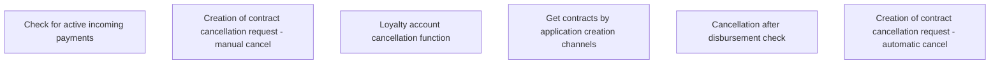

# Common for contract cancellation

```mermaid
graph TD
    Check_for_active_incoming_payments["Check for active incoming payments"]
    Creation_of_contract_cancellation_request_manual_cancel["Creation of contract cancellation request - manual cancel"]
    Loyalty_account_cancellation_function["Loyalty account cancellation function"]
    Get_contracts_by_application_creation_channels["Get contracts by application creation channels"]
    Cancellation_after_disbursement_check["Cancellation after disbursement check"]
    Creation_of_contract_cancellation_request_automatic_cancel["Creation of contract cancellation request - automatic cancel"]
```
