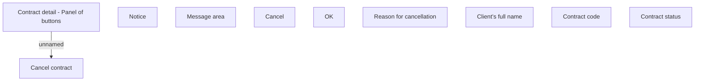

# Contract cancellation

- **Diagram Type**: Custom
- **Package**: HomerSelect/BSL/Analysis Model/Contract Management/Contract cancellation/User Interface Model
- **Diagram ID**: 79898
- **Elements**: 10
- **Connectors**: 1

