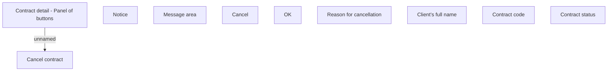

# Contract cancellation

```mermaid
graph TD
    Contract_detail_Panel_of_buttons["Contract detail - Panel of buttons"]
    Notice["Notice"]
    Message_area["Message area"]
    Cancel["Cancel"]
    OK["OK"]
    Reason_for_cancellation["Reason for cancellation"]
    Client_s_full_name["Client’s full name"]
    Contract_code["Contract code"]
    Contract_status["Contract status"]
    Cancel_contract["Cancel contract"]
    Contract_detail_Panel_of_buttons -->|unnamed| Cancel_contract
```
