# Access Rights

- **Diagram Type**: Custom
- **Package**: HomerSelect/BSL/Analysis Model/Contract Management/Contract commodities management/Access Rights
- **Diagram ID**: 136606
- **Elements**: 14
- **Connectors**: 21

```mermaid
graph TD
    ADD_01_650_Edit_Contract_Commodity_CLM["{ADD}01.650 Edit Contract Commodity [CLM]"]
    n_01_650_Edit_Contract_Commodity_non_validated_commodity["01.650 Edit Contract Commodity (non-validated commodity)"]
    ADD_01_650_Edit_Contract_Commodity_skip_validation["{ADD}01.650 Edit Contract Commodity (skip validation)"]
    n_01_650_Edit_Contract_Commodity_validated_commodity["01.650 Edit Contract Commodity (validated commodity)"]
    MOD_01_655_Validate_Contract_Commodity["{MOD}01.655 Validate Contract Commodity"]
    MOD_01_655_Validate_contract_Commodity["{MOD}01.655 Validate contract Commodity"]
    Access_control_to_edit_commodity_fields["Access control to edit commodity fields"]
    n_01_650_Edit_Contract_Commodity_edit_other_fields["01.650 Edit Contract Commodity (edit other fields)"]
    n_01_650_Edit_Contract_Commodity_all_statuses["01.650 Edit Contract Commodity (all statuses)"]
    n_01_650_Edit_Contract_Commodity_all_salesrooms["01.650 Edit Contract Commodity (all salesrooms)"]
    n_01_650_Edit_Contract_Commodity["01.650 Edit Contract Commodity"]
    Access_control_to_Commodity_by_Contract_status["Access control to Commodity by Contract status"]
    Access_control_to_Contract_by_Salesroom["Access control to Contract by Salesroom"]
    n_01_650_Edit_Contract_Commodity["01.650 Edit Contract Commodity"]
    n_01_650_Edit_Contract_Commodity -->|unnamed| ADD_01_650_Edit_Contract_Commodity_skip_validation
    n_01_650_Edit_Contract_Commodity -->|unnamed| n_01_650_Edit_Contract_Commodity_all_salesrooms
    n_01_650_Edit_Contract_Commodity -->|unnamed| Access_control_to_Contract_by_Salesroom
    n_01_650_Edit_Contract_Commodity -->|unnamed| n_01_650_Edit_Contract_Commodity_validated_commodity
    n_01_650_Edit_Contract_Commodity -->|unnamed| n_01_650_Edit_Contract_Commodity_all_statuses
    n_01_650_Edit_Contract_Commodity -->|unnamed| Access_control_to_edit_commodity_fields
    n_01_650_Edit_Contract_Commodity -->|unnamed| Access_control_to_Commodity_by_Contract_status
    n_01_650_Edit_Contract_Commodity -->|unnamed| n_01_650_Edit_Contract_Commodity_edit_other_fields
    n_01_650_Edit_Contract_Commodity -->|unnamed| n_01_650_Edit_Contract_Commodity
    n_01_650_Edit_Contract_Commodity -->|unnamed| n_01_650_Edit_Contract_Commodity_non_validated_commodity
    ADD_01_650_Edit_Contract_Commodity_CLM -->|unnamed| n_01_650_Edit_Contract_Commodity_validated_commodity
    ADD_01_650_Edit_Contract_Commodity_CLM -->|unnamed| n_01_650_Edit_Contract_Commodity_all_salesrooms
    ADD_01_650_Edit_Contract_Commodity_CLM -->|unnamed| Access_control_to_edit_commodity_fields
    ADD_01_650_Edit_Contract_Commodity_CLM -->|unnamed| n_01_650_Edit_Contract_Commodity_all_statuses
    ADD_01_650_Edit_Contract_Commodity_CLM -->|unnamed| n_01_650_Edit_Contract_Commodity_edit_other_fields
    ADD_01_650_Edit_Contract_Commodity_CLM -->|unnamed| ADD_01_650_Edit_Contract_Commodity_skip_validation
    ADD_01_650_Edit_Contract_Commodity_CLM -->|unnamed| Access_control_to_Contract_by_Salesroom
    ADD_01_650_Edit_Contract_Commodity_CLM -->|unnamed| n_01_650_Edit_Contract_Commodity_non_validated_commodity
    ADD_01_650_Edit_Contract_Commodity_CLM -->|unnamed| Access_control_to_Commodity_by_Contract_status
    ADD_01_650_Edit_Contract_Commodity_CLM -->|unnamed| n_01_650_Edit_Contract_Commodity
    MOD_01_655_Validate_contract_Commodity -->|unnamed| MOD_01_655_Validate_Contract_Commodity
```

