# Edit commodity

- **Diagram Type**: Custom
- **Package**: HomerSelect/BSL/Analysis Model/Contract Management/Contract commodities management/User Interface Model
- **Diagram ID**: 161275
- **Elements**: 29
- **Connectors**: 4

```mermaid
graph TD
    Model["Model"]
    ADD_01_650_Edit_Contract_Commodity_CLM["{ADD}01.650 Edit Contract Commodity [CLM]"]
    Commodity_Data_Visibility_Parameters["Commodity Data Visibility Parameters"]
    MSISDN["MSISDN"]
    Commodity_category["Commodity category"]
    Commodity_type["Commodity type"]
    Name["Name"]
    Producer["Producer"]
    Model_number["Model number"]
    Serial_number["Serial number"]
    Engine_number["Engine number"]
    Color["Color"]
    Ownership_book_number["Ownership book number"]
    Vehicle_registration_number["Vehicle registration number"]
    Vehicle_registration_expiration_date["Vehicle registration expiration date"]
    License_plate_number["License plate number"]
    Price["Price"]
    Delivery_type["Delivery type"]
    Skip_validation["Skip validation"]
    Manufacture_year["Manufacture year"]
    IMEI["IMEI"]
    Stock_keeping_unit["Stock keeping unit"]
    MOD_Edit_commodity["{MOD}Edit commodity"]
    Tab_Commodity["Tab-Commodity"]
    ADD_Commodity_Data_Validation_Parameters["{ADD}Commodity Data Validation Parameters"]
    Customization_Edit_Commodity_Customization["Customization : Edit Commodity Customization"]
    Cancel["Cancel"]
    Save["Save"]
    Edit_commodity["Edit commodity"]
    Tab_Commodity -->|unnamed| Edit_commodity
    Edit_commodity -->|unnamed| ADD_Commodity_Data_Validation_Parameters
    MOD_Edit_commodity -->|unnamed| Commodity_Data_Visibility_Parameters
    Edit_commodity -->|unnamed| ADD_01_650_Edit_Contract_Commodity_CLM
```

