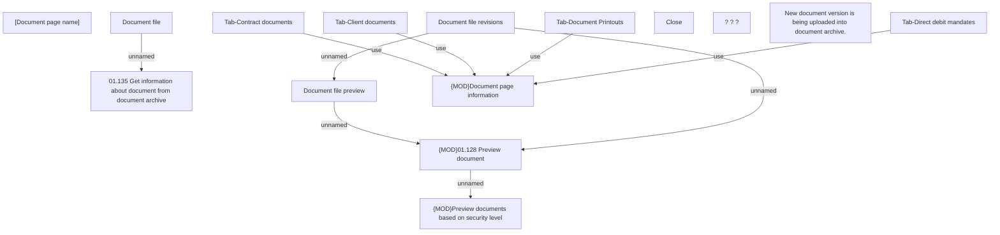

# Document page information

- **Diagram Type**: Custom
- **Package**: HomerSelect/BSL/Analysis Model/Contract Management/Contract detail/Document info/User Interface Model
- **Diagram ID**: 150908
- **Elements**: 16
- **Connectors**: 9

