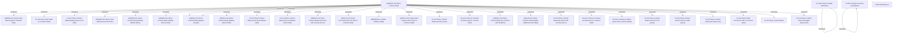

# Access Rights

```mermaid
graph TD
    ADD_01_210_Show_client_data_Payment_Channel_data["{ADD}01.210 Show client data (Payment Channel data)"]
    n_01_210_Show_Client_data_on_Contract_detail["01.210 Show Client data on Contract detail"]
    n_01_210_Show_contract_detail_display_bank_accout_data["01.210 Show contract detail (display bank accout data)"]
    MOD_01_210_Show_client_data_show_documents["{MOD}01.210 Show client data (show documents)"]
    ADD_01_210_Show_contract_detail_display_Marital_status["{ADD}01.210 Show contract detail (display Marital status)"]
    ADD_01_210_Show_contract_detail_display_Parent_name["{ADD}01.210 Show contract detail (display Parent name)"]
    ADD_01_210_Show_contract_detail_display_Gender["{ADD}01.210 Show contract detail (display Gender)"]
    ADD_01_210_Show_contract_detail_display_Date_of_birth["{ADD}01.210 Show contract detail (display Date of birth)"]
    n_01_210_Show_contract_detail_show_client_address_data["01.210 Show contract detail (show client address data)"]
    n_01_210_Show_contract_detail_show_unmasked_client_email["01.210 Show contract detail (show unmasked client email)"]
    ADD_01_210_Show_contract_detail_document_with_security_level["{ADD}01.210 Show contract detail (document with security level 2)"]
    n_01_163_Perform_Lenddo_verification["01.163 Perform Lenddo verification"]
    n_01_163_Perform_Lenddo_verification["01.163 Perform Lenddo verification"]
    ADD_01_210_Show_Document_Printouts_Tab_on_Contract_detail["{ADD} 01.210 Show Document Printouts Tab on Contract detail"]
    MOD_Phone_number_visibility_setting["{MOD}Phone number visibility setting"]
    ADD_01_210_Show_client_s_phone_Tab_Client_on_Contract_detail["{ADD} 01.210 Show client´s phone (Tab Client on Contract detail)"]
    n_01_210_Show_contract_detail_all_sales_areas["01.210 Show contract detail (all sales areas)"]
    Access_control_to_Contract_by_Sales_area_for_contract_detail["Access control to Contract by Sales area for contract detail"]
    ADD_01_210_Show_contract_detail_my_contract_with_limitation["{ADD}01.210 Show contract detail (my contract with limitation)"]
    n_01_050_Change_insurance_prolongation["01.050 Change insurance prolongation"]
    DEL_01_210_Show_contract_detail_display_additional_client_da["{DEL}01.210 Show contract detail (display additional client data)"]
    n_01_050_Change_insurance_prolongation["01.050 Change insurance prolongation"]
    n_01_210_Show_contract_detail_document_with_security_level_1["01.210 Show contract detail (document with security level 1)"]
    Access_control_to_Contract_by_Salesroom_for_contract_detail["Access control to Contract by Salesroom for contract detail"]
    Process_contracts_in_2BoD_queue_from_contract_detail["Process contracts in 2BoD queue (from contract detail)"]
    n_01_210_Show_contract_detail_contract_in_FO_queue["01.210 Show contract detail (contract in FO queue)"]
    n_01_210_Show_contract_detail_contract_in_BO_queue["01.210 Show contract detail (contract in BO queue)"]
    n_01_210_Show_contract_detail_all_salesrooms["01.210 Show contract detail (all salesrooms)"]
    n_01_210_Show_Client_documents_Tab_on_Contract_detail["01.210 Show Client documents Tab on Contract detail"]
    n_01_210_Show_contract_detail["01.210 Show contract detail"]
    MOD_01_210_Show_contract_detail["{MOD}01.210 Show contract detail"]
    n_01_210_Show_contract_detail_managed_salesrooms["01.210 Show contract detail (managed salesrooms)"]
    External_Reference["External Reference"]
    MOD_01_210_Show_contract_detail -->|unnamed| Process_contracts_in_2BoD_queue_from_contract_detail
    MOD_01_210_Show_contract_detail -->|unnamed| n_01_210_Show_contract_detail_contract_in_FO_queue
    MOD_01_210_Show_contract_detail -->|unnamed| n_01_210_Show_contract_detail_contract_in_BO_queue
    MOD_01_210_Show_contract_detail -->|unnamed| n_01_210_Show_contract_detail_all_salesrooms
    MOD_01_210_Show_contract_detail -->|unnamed| n_01_210_Show_Client_documents_Tab_on_Contract_detail
    MOD_01_210_Show_contract_detail -->|unnamed| n_01_210_Show_contract_detail
    MOD_01_210_Show_contract_detail -->|unnamed| ADD_01_210_Show_Document_Printouts_Tab_on_Contract_detail
    MOD_01_210_Show_contract_detail -->|unnamed| ADD_01_210_Show_client_s_phone_Tab_Client_on_Contract_detail
    MOD_01_210_Show_contract_detail -->|unnamed| n_01_210_Show_Client_data_on_Contract_detail
    MOD_01_210_Show_contract_detail -->|unnamed| n_01_210_Show_contract_detail_display_bank_accout_data
    MOD_01_210_Show_contract_detail -->|unnamed| MOD_01_210_Show_client_data_show_documents
    MOD_01_210_Show_contract_detail -->|unnamed| ADD_01_210_Show_contract_detail_display_Marital_status
    MOD_01_210_Show_contract_detail -->|unnamed| ADD_01_210_Show_contract_detail_display_Parent_name
    MOD_01_210_Show_contract_detail -->|unnamed| ADD_01_210_Show_contract_detail_display_Gender
    MOD_01_210_Show_contract_detail -->|unnamed| ADD_01_210_Show_contract_detail_display_Gender
    MOD_01_210_Show_contract_detail -->|unnamed| ADD_01_210_Show_contract_detail_display_Date_of_birth
    MOD_01_210_Show_contract_detail -->|unnamed| n_01_210_Show_contract_detail_show_client_address_data
    MOD_01_210_Show_contract_detail -->|unnamed| n_01_210_Show_contract_detail_show_unmasked_client_email
    MOD_01_210_Show_contract_detail -->|unnamed| ADD_01_210_Show_contract_detail_document_with_security_level
    n_01_163_Perform_Lenddo_verification -->|unnamed| n_01_163_Perform_Lenddo_verification
    MOD_01_210_Show_contract_detail -->|unnamed| ADD_01_210_Show_client_data_Payment_Channel_data
    MOD_01_210_Show_contract_detail -->|unnamed| MOD_Phone_number_visibility_setting
    MOD_01_210_Show_contract_detail -->|unnamed| n_01_210_Show_contract_detail_managed_salesrooms
    MOD_01_210_Show_contract_detail -->|unnamed| n_01_210_Show_contract_detail_all_sales_areas
    MOD_01_210_Show_contract_detail -->|unnamed| Access_control_to_Contract_by_Sales_area_for_contract_detail
    MOD_01_210_Show_contract_detail -->|unnamed| ADD_01_210_Show_contract_detail_my_contract_with_limitation
    MOD_01_210_Show_contract_detail -->|unnamed| DEL_01_210_Show_contract_detail_display_additional_client_da
    MOD_01_210_Show_contract_detail -->|unnamed| n_01_210_Show_contract_detail_document_with_security_level_1
    MOD_01_210_Show_contract_detail -->|unnamed| Access_control_to_Contract_by_Salesroom_for_contract_detail
    n_01_050_Change_insurance_prolongation -->|unnamed| n_01_050_Change_insurance_prolongation
```
