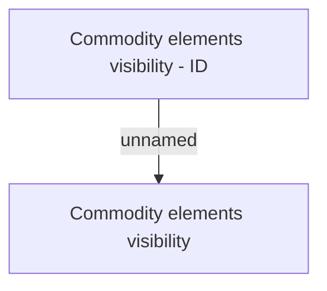

# Show contract detail - Business Rules - ID

```mermaid
graph TD
    Commodity_elements_visibility_ID["Commodity elements visibility - ID"]
    Commodity_elements_visibility["Commodity elements visibility"]
    Commodity_elements_visibility_ID -->|unnamed| Commodity_elements_visibility
```
