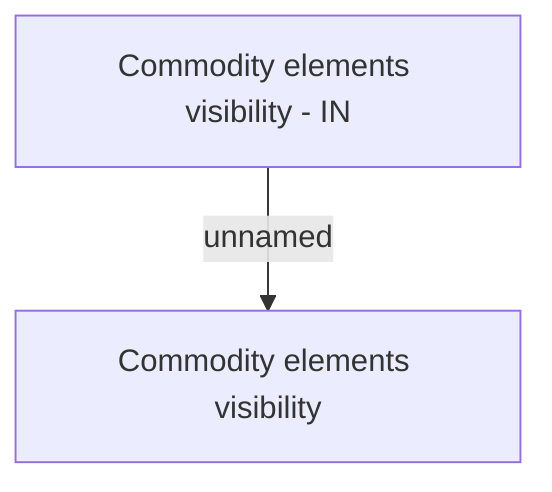

# Show contract detail - Business Rules - IN

- **Diagram Type**: Custom
- **Package**: HomerSelect/BSL/Analysis Model/Contract Management/Contract detail/Show contract detail/Business Rules/IN
- **Diagram ID**: 133382
- **Elements**: 2
- **Connectors**: 1

