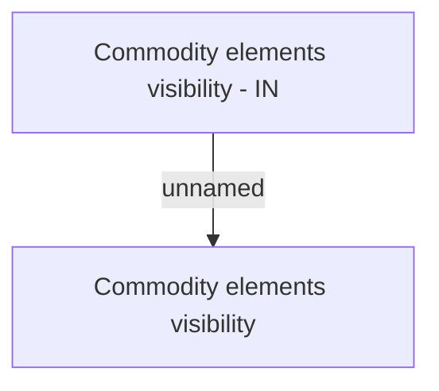

# Show contract detail - Business Rules - IN

```mermaid
graph TD
    Commodity_elements_visibility_IN["Commodity elements visibility - IN"]
    Commodity_elements_visibility["Commodity elements visibility"]
    Commodity_elements_visibility_IN -->|unnamed| Commodity_elements_visibility
```
