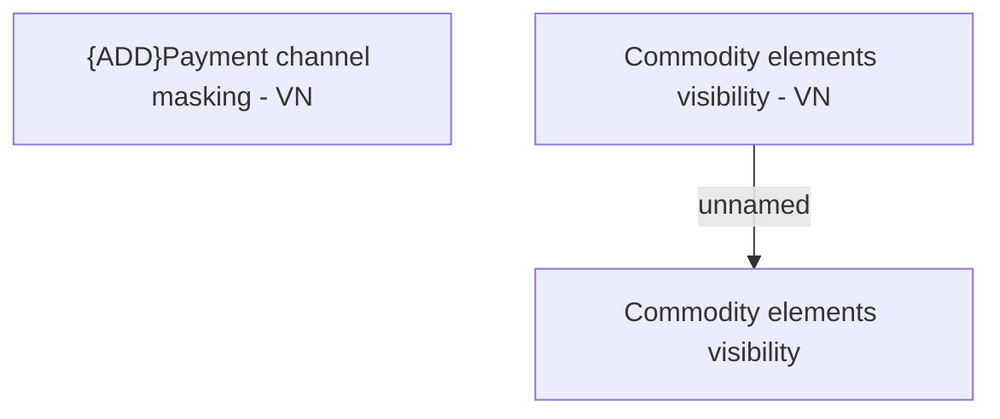

# Show contract detail - Business Rules - VN

- **Diagram Type**: Custom
- **Package**: HomerSelect/BSL/Analysis Model/Contract Management/Contract detail/Show contract detail/Business Rules/VN
- **Diagram ID**: 162191
- **Elements**: 3
- **Connectors**: 1

