# Contract detail - header

- **Diagram Type**: Custom
- **Package**: HomerSelect/BSL/Analysis Model/Contract Management/Contract detail/Show contract detail/User Interface Model
- **Diagram ID**: 164647
- **Elements**: 23
- **Connectors**: 0

```mermaid
graph TD
    MOD_Source_offer_type_code["{MOD}Source offer type code"]
    Status_transition_reason["Status transition reason"]
    Contract_detail_Contract_detail["Contract detail : Contract detail"]
    Sales_area["Sales area"]
    Waiting_for_termination["Waiting for termination"]
    Partner_code["Partner code"]
    Partner_name["Partner name"]
    Contract_owner["Contract owner"]
    Payment_status["Payment status"]
    POS_business_model["POS business model"]
    Contract_package_code["Contract package code"]
    SA_Code["SA Code"]
    Salesroom_code["Salesroom code"]
    Status_description["Status description"]
    Salesroom_name["Salesroom name"]
    Contract_created["Contract created"]
    Contract_status["Contract status"]
    Application_created["Application created"]
    Contract_financing_partner["Contract financing partner"]
    MOD_Client_full_name["{MOD}Client full name"]
    Contract_number["Contract number"]
    Product_information["Product information"]
    Contract_detail["Contract detail"]
```

