# Contract detail

- **Diagram Type**: Custom
- **Package**: HomerSelect/BSL/Analysis Model/Contract Management/Contract detail/Show contract detail/User Interface Model
- **Diagram ID**: 164646
- **Elements**: 38
- **Connectors**: 7

```mermaid
graph TD
    Notification_panel["Notification panel"]
    Notification_panel["Notification panel"]
    Customer_offers["Customer offers"]
    The_client_has_no_active_marketing_offer["The client has no active marketing offer."]
    Display_customer_offers["Display customer offers"]
    Customer_Offers_operation_panel["Customer Offers operation panel"]
    MOD_Phone_number_visibility_setting["{MOD}Phone number visibility setting"]
    DEL_Get_original_number_instead_of_alias_for_Unique_Id_docum["{DEL}Get original number instead of alias for Unique Id document"]
    Tab_Consolidation["Tab-Consolidation"]
    Non_Product_Marketing_Offers["Non-Product Marketing Offers"]
    Customer_offers["Customer offers"]
    Product_Offers_in_Contract_detail["Product Offers in Contract detail"]
    n_12_613_Show_account_detail_in_AM["12.613 Show account detail in AM"]
    Tab_Contract_supplements["Tab-Contract supplements"]
    MOD_12_601_Show_account_detail["{MOD}12.601 Show account detail"]
    Show_account_detail["Show account detail"]
    Account["Account"]
    Account["Account"]
    Tab_Cards["Tab-Cards"]
    Panel_of_buttons["Panel of buttons"]
    Contract_detail_header["Contract detail - header"]
    Tab_Payment_channels["Tab-Payment channels"]
    Tab_Extended_properties["Tab-Extended properties"]
    Tab_Contract_documents["Tab-Contract documents"]
    Tab_Contract_registration["Tab-Contract registration"]
    Tab_Document_Printouts["Tab-Document Printouts"]
    Process_contracts_in_2BoD_queue_from_contract_detail["Process contracts in 2BoD queue (from contract detail)"]
    Tab_Services["Tab-Services"]
    Tab_Insurance["Tab-Insurance"]
    MOD_01_210_Show_contract_detail["{MOD}01.210 Show contract detail"]
    Tab_List_of_communication["Tab-List of communication"]
    Tab_Direct_debit_mandates["Tab-Direct debit mandates"]
    Tab_Commodity["Tab-Commodity"]
    Tab_Client_documents["Tab-Client documents"]
    Tab_Client["Tab-Client"]
    Tab_Contract_information["Tab-Contract information"]
    Tab_panel["Tab panel"]
    Contract_detail["Contract detail"]
    Contract_detail -->|unnamed| MOD_01_210_Show_contract_detail
    MOD_01_210_Show_contract_detail -->|unnamed| Process_contracts_in_2BoD_queue_from_contract_detail
    MOD_01_210_Show_contract_detail -->|unnamed| MOD_Phone_number_visibility_setting
    MOD_01_210_Show_contract_detail -->|unnamed| DEL_Get_original_number_instead_of_alias_for_Unique_Id_docum
    Account -->|unnamed| Show_account_detail
    Account -->|unnamed| n_12_613_Show_account_detail_in_AM
    Account -->|unnamed| MOD_12_601_Show_account_detail
```

