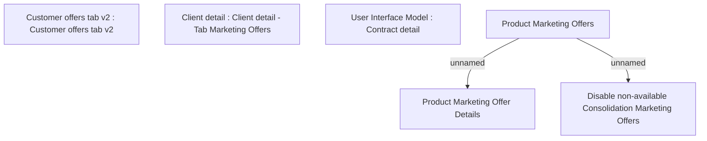

# Customer offers

- **Diagram Type**: Custom
- **Package**: HomerSelect/BSL/Analysis Model/Contract Management/Contract detail/Show contract detail/User Interface Model/Customer offers
- **Diagram ID**: 148790
- **Elements**: 6
- **Connectors**: 2

