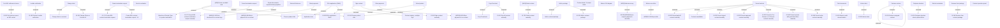

# Panel of buttons

```mermaid
graph TD
    Choose_product_offer["Choose product offer"]
    Selection_of_Product_Type_for_product_calculation["Selection of Product Type for product calculation"]
    ADD_Create_new_debit_card["{ADD}Create new debit card"]
    n_01_910_Change_Client_on_Contract_v2["01.910 Change Client on Contract v2"]
    n_01_552_Set_business_event_on_WO_contact["01.552 Set business event on WO contact"]
    Post_WO_settlement_closure["Post WO settlement closure"]
    Contract_signing_multiple_sign["Contract signing - multiple sign"]
    n_01_163_Perform_Lenddo_verification["01.163 Perform Lenddo verification"]
    Lenddo_verification["Lenddo verification"]
    Create_REL_contract_termination_request_UI["Create REL contract termination request - UI"]
    Release_contract["Release contract"]
    Choose_product_offer["Choose product offer"]
    Application_form["Application form"]
    Contract_cancellation["Contract cancellation"]
    Pay_off_contracts["Pay off contracts"]
    Add_to_contract_package["Add to contract package"]
    Change_client_on_contract["Change client on contract"]
    Send_to_evaluation["Send to evaluation"]
    n_01_172_Cancel_REL_contract_termination_request_manually["01.172 Cancel REL contract termination request manually"]
    n_01_171_Create_REL_contract_termination_request["01.171 Create REL contract termination request"]
    Cancel_termination_request["Cancel termination request"]
    Create_termination_request["Create termination request"]
    n_01_592_Cancel_paid_off_contract_manually["01.592 Cancel paid-off contract manually"]
    Refuse_new_offers["Refuse new offers"]
    External_Reference["External Reference"]
    MOD_01_183_Print_documents_for_contract_sign["{MOD}01.183 Print documents for contract sign"]
    Reprint_documents_unprinted_during_signiture["Reprint documents unprinted during signiture "]
    MOD_05_094_Block_payments_for_a_contract["{MOD}05.094 Block payments for a contract"]
    MOD_05_093_Allow_payments_for_a_contract["{MOD}05.093 Allow payments for a contract"]
    Block_payments["Block payments"]
    Allow_payments["Allow payments"]
    n_01_730_Finish_contract_manually["01.730 Finish contract manually"]
    MOD_Finish_contract["{MOD}Finish contract"]
    n_05_092_MOD_Disburse_outgoing_payments_manually["05.092 {MOD}Disburse outgoing payments manually"]
    MOD_Disburse_money["{MOD}Disburse money"]
    Change_client["Change client"]
    Select_product["Select product"]
    Postpone_decision["Postpone decision"]
    n_01_031_Release_assigned_contract["01.031 Release assigned contract"]
    Release_contract["Release contract"]
    MOD_01_159_Reject_offer["{MOD}01.159 Reject offer"]
    n_01_590_Cancel_active_contract_manually["01.590 Cancel active contract manually"]
    n_01_340_Cancel_contract_with_generated_offers_manually["01.340 Cancel contract with generated offers manually"]
    n_01_325_Cancel_In_Pre_Process_or_In_Process_contract_manual["01.325 Cancel In Pre-Process or In Process contract manually"]
    Contract_detail_Contract_detail["Contract detail : Contract detail"]
    Master_GUI_diagram["Master GUI diagram"]
    n_01_083_Fill_in_application_2BoD["01.083 Fill in application - 2BoD"]
    Fill_in_application_2BoD["Fill in application (2BoD)"]
    n_01_410_Pay_off_contract_manually["01.410 Pay-off contract manually"]
    n_01_200_Add_to_contract_package["01.200 Add to contract package"]
    n_01_190_Reprint_credit_documentation["01.190 Reprint credit documentation"]
    n_01_180_Sign_contract_manually["01.180 Sign contract manually"]
    n_01_305_Inform_client["01.305 Inform client"]
    n_01_320_Cancel_approved_contract_manually["01.320 Cancel approved contract manually"]
    Sign_contract["Sign contract"]
    Inform_client["Inform client"]
    Print_documents["Print documents"]
    Remove_from_package["Remove from package"]
    Cancel_contract["Cancel contract"]
    Pay_off_contract["Pay-off contract"]
    n_01_330_Cancel_signed_contract_manually["01.330 Cancel signed contract manually"]
    Refresh_evaluation["Refresh evaluation"]
    Add_to_package["Add to package"]
    n_01_154_Postpone_decision_about_optional_offers["01.154 Postpone decision about optional offers"]
    Contract_operation_panel["Contract operation panel"]
    n_01_240_Remove_from_contract_package["01.240 Remove from contract package"]
    n_01_010_Choose_product_offer["01.010 Choose product offer"]
    Select_product -->|unnamed| Choose_product_offer
    Reprint_documents_unprinted_during_signiture -->|unnamed| MOD_01_183_Print_documents_for_contract_sign
    Cancel_contract -->|unnamed| n_01_592_Cancel_paid_off_contract_manually
    Create_termination_request -->|unnamed| n_01_171_Create_REL_contract_termination_request
    Cancel_termination_request -->|unnamed| n_01_172_Cancel_REL_contract_termination_request_manually
    Change_client -->|unnamed| Change_client_on_contract
    Add_to_package -->|unnamed| Add_to_contract_package
    Pay_off_contract -->|unnamed| Pay_off_contracts
    ADD_Create_new_debit_card -->|unnamed| Choose_product_offer
    Fill_in_application_2BoD -->|unnamed| Application_form
    MOD_Finish_contract -->|unnamed| n_01_730_Finish_contract_manually
    Release_contract -->|unnamed| Release_contract
    Create_termination_request -->|unnamed| Create_REL_contract_termination_request_UI
    Lenddo_verification -->|unnamed| n_01_163_Perform_Lenddo_verification
    Sign_contract -->|unnamed| Contract_signing_multiple_sign
    Post_WO_settlement_closure -->|unnamed| n_01_552_Set_business_event_on_WO_contact
    Change_client -->|unnamed| n_01_910_Change_Client_on_Contract_v2
    ADD_Create_new_debit_card -->|unnamed| Selection_of_Product_Type_for_product_calculation
    Cancel_contract -->|unnamed| Contract_cancellation
    Pay_off_contract -->|unnamed| n_01_410_Pay_off_contract_manually
    ADD_Create_new_debit_card -->|unnamed| n_01_010_Choose_product_offer
    Remove_from_package -->|unnamed| n_01_240_Remove_from_contract_package
    Postpone_decision -->|unnamed| n_01_154_Postpone_decision_about_optional_offers
    Cancel_contract -->|unnamed| n_01_330_Cancel_signed_contract_manually
    Cancel_contract -->|unnamed| n_01_320_Cancel_approved_contract_manually
    Inform_client -->|unnamed| n_01_305_Inform_client
    Sign_contract -->|unnamed| n_01_180_Sign_contract_manually
    Block_payments -->|unnamed| MOD_05_094_Block_payments_for_a_contract
    Add_to_package -->|unnamed| n_01_200_Add_to_contract_package
    Allow_payments -->|unnamed| MOD_05_093_Allow_payments_for_a_contract
    Fill_in_application_2BoD -->|unnamed| n_01_083_Fill_in_application_2BoD
    Cancel_contract -->|unnamed| n_01_325_Cancel_In_Pre_Process_or_In_Process_contract_manual
    Cancel_contract -->|unnamed| n_01_340_Cancel_contract_with_generated_offers_manually
    Cancel_contract -->|unnamed| n_01_590_Cancel_active_contract_manually
    Refuse_new_offers -->|unnamed| MOD_01_159_Reject_offer
    Release_contract -->|unnamed| n_01_031_Release_assigned_contract
    MOD_Disburse_money -->|unnamed| n_05_092_MOD_Disburse_outgoing_payments_manually
    Select_product -->|unnamed| n_01_010_Choose_product_offer
    Print_documents -->|unnamed| n_01_190_Reprint_credit_documentation
```
