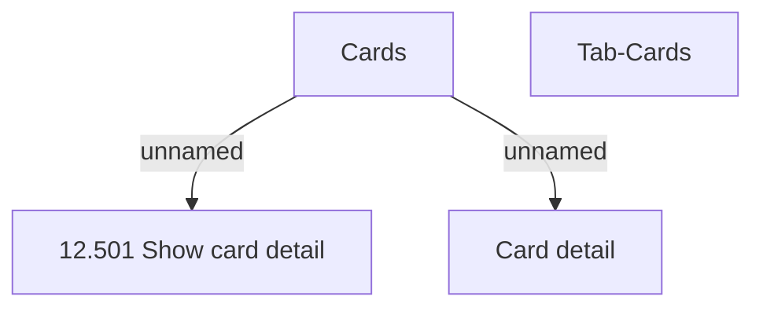

# Tab-Cards

- **Diagram Type**: Custom
- **Package**: HomerSelect/BSL/Analysis Model/Contract Management/Contract detail/Show contract detail/User Interface Model/Tab-Cards
- **Diagram ID**: 136607
- **Elements**: 4
- **Connectors**: 2

