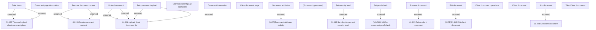

# Tab-Client documents

```mermaid
graph TD
    Take_photo["Take photo"]
    Document_page_information["Document page information"]
    MOD_Document_attributes_visibility["{MOD}Document attributes visibility"]
    Remove_document_content["Remove document content"]
    Take_photo["Take photo"]
    Retry_document_upload["Retry document upload"]
    Upload_document["Upload document"]
    Client_document_page_operations["Client document page operations"]
    Document_information["Document information"]
    Client_document_page["Client document page"]
    Document_attributes["Document attributes"]
    Document_type_name["[Document type name]"]
    n_01_126_Upload_client_document_file["01.126 Upload client document file"]
    MOD_01_113_Edit_client_document["{MOD}01.113 Edit client document"]
    n_01_129_Take_and_upload_client_document_photo["01.129 Take and upload client document photo"]
    n_01_133_Delete_document_content["01.133 Delete document content"]
    MOD_01_105_Set_document_proof_check["{MOD}01.105 Set document proof check"]
    n_01_123_Delete_client_document["01.123 Delete client document"]
    n_01_103_Add_client_document["01.103 Add client document"]
    n_01_116_Set_client_document_security_level["01.116 Set client document security level"]
    Retry_document_upload["Retry document upload"]
    Set_security_level["Set security level"]
    Remove_document_content["Remove document content"]
    Set_proof_check["Set proof check"]
    Remove_document["Remove document"]
    Edit_document["Edit document"]
    Upload_document["Upload document"]
    Client_document_operations["Client document operations"]
    Client_document["Client document"]
    Add_document["Add document"]
    Tab_Client_documents["Tab - Client documents"]
    Add_document -->|unnamed| n_01_103_Add_client_document
    Upload_document -->|unnamed| n_01_126_Upload_client_document_file
    Edit_document -->|unnamed| MOD_01_113_Edit_client_document
    Remove_document -->|unnamed| n_01_123_Delete_client_document
    Set_proof_check -->|unnamed| MOD_01_105_Set_document_proof_check
    Remove_document_content -->|unnamed| n_01_133_Delete_document_content
    Set_security_level -->|unnamed| n_01_116_Set_client_document_security_level
    Retry_document_upload -->|unnamed| n_01_126_Upload_client_document_file
    Document_attributes -->|unnamed| MOD_Document_attributes_visibility
    Upload_document -->|unnamed| n_01_126_Upload_client_document_file
    Retry_document_upload -->|unnamed| n_01_126_Upload_client_document_file
    Take_photo -->|unnamed| n_01_129_Take_and_upload_client_document_photo
    Remove_document_content -->|unnamed| n_01_133_Delete_document_content
    Take_photo -->|unnamed| n_01_129_Take_and_upload_client_document_photo
```
