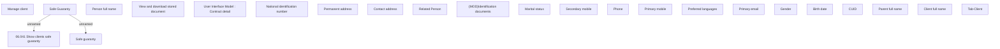

# Tab-Client

```mermaid
graph TD
    Manage_client["Manage client"]
    Safe_guaranty["Safe guaranty"]
    n_06_041_Show_clients_safe_guaranty["06.041 Show clients safe guaranty"]
    Safe_Guaranty["Safe Guaranty"]
    Person_full_name["Person full name"]
    View_and_download_stored_document["View and download stored document"]
    User_Interface_Model_Contract_detail["User Interface Model : Contract detail"]
    National_identification_number["National identification number"]
    Permanent_address["Permanent address"]
    Contact_address["Contact address"]
    Related_Person["Related Person"]
    MOD_Identification_documents["{MOD}Identification documents"]
    Marital_status["Marital status"]
    Secondary_mobile["Secondary mobile"]
    Phone["Phone"]
    Primary_mobile["Primary mobile"]
    Preferred_languages["Preferred languages"]
    Primary_email["Primary email"]
    Gender["Gender"]
    Birth_date["Birth date"]
    CUID["CUID"]
    Parent_full_name["Parent full name"]
    Client_full_name["Client full name"]
    Tab_Client["Tab-Client"]
    Safe_Guaranty -->|unnamed| n_06_041_Show_clients_safe_guaranty
    Safe_Guaranty -->|unnamed| Safe_guaranty
```
