# Tab-Commodity

- **Diagram Type**: Custom
- **Package**: HomerSelect/BSL/Analysis Model/Contract Management/Contract detail/Show contract detail/User Interface Model/Tab-Commodity
- **Diagram ID**: 144906
- **Elements**: 29
- **Connectors**: 3

```mermaid
graph TD
    Model["Model"]
    ADD_01_650_Edit_Contract_Commodity_CLM["{ADD}01.650 Edit Contract Commodity [CLM]"]
    Price["Price"]
    Manufacture_year["Manufacture year"]
    License_plate_number["License plate number"]
    Ownership_book_number["Ownership book number"]
    Color["Color"]
    Vehicle_registration_expiration_date["Vehicle registration expiration date"]
    Stock_keeping_unit["Stock keeping unit"]
    Model_number["Model number"]
    Engine_number["Engine number"]
    MSISDN["MSISDN"]
    Commodity_category["Commodity category"]
    Producer["Producer"]
    Vehicle_registration_number["Vehicle registration number"]
    Delivery_type["Delivery type"]
    Name["Name"]
    Commodity_type["Commodity type"]
    IMEI["IMEI"]
    Serial_number["Serial number"]
    Validate_commodity["Validate commodity"]
    Edit_commodity["Edit commodity"]
    Operational_buttons_commodity_operations["Operational buttons - commodity operations"]
    Commodity_information["Commodity information"]
    Edit_commodity["Edit commodity"]
    Commodity_elements_visibility["Commodity elements visibility"]
    MOD_01_655_Validate_contract_Commodity["{MOD}01.655 Validate contract Commodity"]
    Commodity["Commodity"]
    Tab_Commodity["Tab-Commodity"]
    Validate_commodity -->|unnamed| MOD_01_655_Validate_contract_Commodity
    Commodity_information -->|unnamed| Commodity_elements_visibility
    Edit_commodity -->|unnamed| ADD_01_650_Edit_Contract_Commodity_CLM
```

