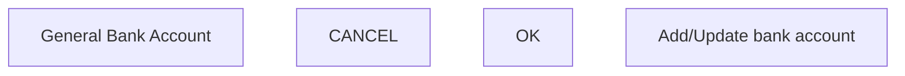

# Add/Update bank account

- **Diagram Type**: Custom
- **Package**: HomerSelect/BSL/Analysis Model/Contract Management/Contract detail/Show contract detail/User Interface Model/Tab-Consolidation/Add/Update bank account
- **Diagram ID**: 122874
- **Elements**: 4
- **Connectors**: 0

