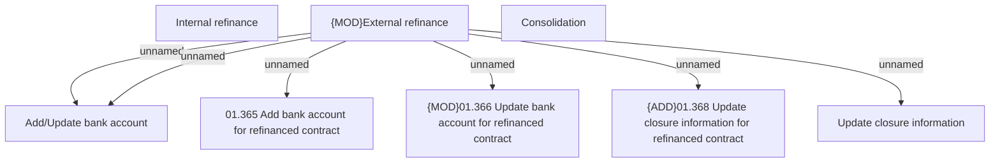

# Tab-Consolidation

```mermaid
graph TD
    Update_closure_information["Update closure information"]
    ADD_01_368_Update_closure_information_for_refinanced_contrac["{ADD}01.368 Update closure information for refinanced contract"]
    Internal_refinance["Internal refinance"]
    MOD_01_366_Update_bank_account_for_refinanced_contract["{MOD}01.366 Update bank account for refinanced contract"]
    n_01_365_Add_bank_account_for_refinanced_contract["01.365 Add bank account for refinanced contract"]
    Add_Update_bank_account["Add/Update bank account"]
    MOD_External_refinance["{MOD}External refinance"]
    Consolidation["Consolidation"]
    MOD_External_refinance -->|unnamed| Add_Update_bank_account
    MOD_External_refinance -->|unnamed| Add_Update_bank_account
    MOD_External_refinance -->|unnamed| n_01_365_Add_bank_account_for_refinanced_contract
    MOD_External_refinance -->|unnamed| MOD_01_366_Update_bank_account_for_refinanced_contract
    MOD_External_refinance -->|unnamed| ADD_01_368_Update_closure_information_for_refinanced_contrac
    MOD_External_refinance -->|unnamed| Update_closure_information
```
