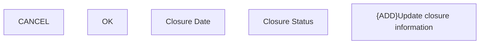

# Update closure information

- **Diagram Type**: Custom
- **Package**: HomerSelect/BSL/Analysis Model/Contract Management/Contract detail/Show contract detail/User Interface Model/Tab-Consolidation/{ADD}Update closure information
- **Diagram ID**: 117421
- **Elements**: 5
- **Connectors**: 0

