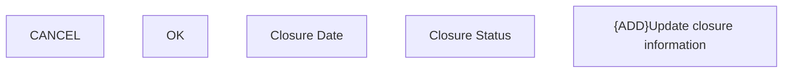

# Update closure information

```mermaid
graph TD
    CANCEL["CANCEL"]
    OK["OK"]
    Closure_Date["Closure Date
"]
    Closure_Status["Closure Status"]
    ADD_Update_closure_information["{ADD}Update closure information"]
```
