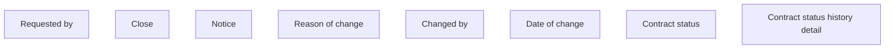

# Contract status history detail

- **Diagram Type**: Custom
- **Package**: HomerSelect/BSL/Analysis Model/Contract Management/Contract detail/Show contract detail/User Interface Model/Tab-Contract information/Contract status history detail
- **Diagram ID**: 111796
- **Elements**: 8
- **Connectors**: 0

