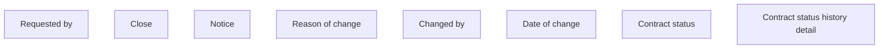

# Contract status history detail

```mermaid
graph TD
    Requested_by["Requested by"]
    Close["Close"]
    Notice["Notice"]
    Reason_of_change["Reason of change"]
    Changed_by["Changed by"]
    Date_of_change["Date of change"]
    Contract_status["Contract status"]
    Contract_status_history_detail["Contract status history detail"]
```
