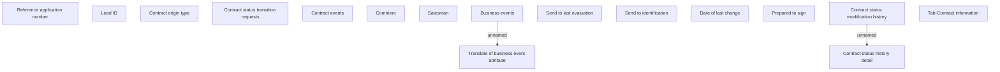

# Tab-Contract information

```mermaid
graph TD
    Reference_application_number["Reference application number"]
    Translate_of_business_event_attribute["Translate of business event attribute"]
    Lead_ID["Lead ID"]
    Contract_origin_type["Contract origin type"]
    Contract_status_transition_requests["Contract status transition requests"]
    Contract_events["Contract events"]
    Contract_status_history_detail["Contract status history detail"]
    Comment["Comment"]
    Salesman["Salesman"]
    Business_events["Business events"]
    Send_to_last_evaluation["Send to last evaluation"]
    Send_to_identification["Send to identification"]
    Date_of_last_change["Date of last change"]
    Prepared_to_sign["Prepared to sign"]
    Contract_events["Contract events"]
    Contract_status_modification_history["Contract status modification history"]
    Tab_Contract_information["Tab-Contract information"]
    Contract_status_modification_history -->|unnamed| Contract_status_history_detail
    Business_events -->|unnamed| Translate_of_business_event_attribute
```
