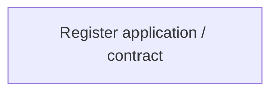

# Tab-Contract registration

- **Diagram Type**: Custom
- **Package**: HomerSelect/BSL/Analysis Model/Contract Management/Contract detail/Show contract detail/User Interface Model/Tab-Contract registration
- **Diagram ID**: 163233
- **Elements**: 1
- **Connectors**: 0

