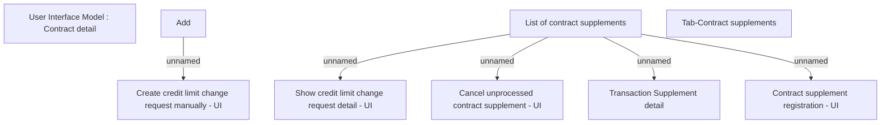

# Tab-Contract supplements

- **Diagram Type**: Custom
- **Package**: HomerSelect/BSL/Analysis Model/Contract Management/Contract detail/Show contract detail/User Interface Model/Tab-Contract supplements
- **Diagram ID**: 160817
- **Elements**: 9
- **Connectors**: 5

