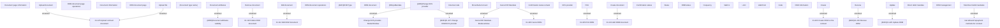

# Tab-Direct debit mandates

```mermaid
graph TD
    Document_page_information["Document page information"]
    MOD_Document_attributes_visibility["{MOD}Document attributes visibility"]
    n_01_102_Add_DDM_document["01.102 Add DDM document"]
    Upload_file["Upload file"]
    DDM_document_page_operations["DDM document page operations"]
    Document_information["Document information"]
    DDM_document_page["DDM document page"]
    Document_attributes["Document attributes"]
    Document_type_name["[Document type name]"]
    Upload_document["Upload document"]
    Remove_document["Remove document"]
    Edit_document["Edit document"]
    DDM_document_operations["DDM document operations"]
    ADD_DDM_Type["{ADD}DDM Type"]
    n_01_125_Upload_contract_document["01.125 Upload contract document"]
    DDM_document["DDM document"]
    DEL_eMandate["{DEL}eMandate"]
    Change_ECS_provider_Modal_Window["Change ECS provider - Modal Window"]
    ADD_Change_ECS_provider["{ADD}Change ECS provider"]
    External_code["External code"]
    Get_allowed_repayment_methods_for_contract["Get allowed repayment methods for contract"]
    n_01_122_Delete_DDM_document["01.122 Delete DDM document"]
    n_01_112_Edit_DDM_document["01.112 Edit DDM document"]
    Show_Bank_Account["Show Bank Account"]
    Cancel_DD_Mandate_Modal_window["Cancel DD Mandate - Modal window"]
    n_01_426_Cancel_DDM["01.426 Cancel DDM"]
    Cancel_DD_Mandate["Cancel DD Mandate"]
    Confirmation_status_remark["Confirmation status remark"]
    ECS_provider["ECS provider"]
    n_01_435_Print_DDM["01.435 Print DDM"]
    Print["Print"]
    n_01_420_Create_DDM_on_the_contract["01.420 Create DDM on the contract"]
    MOD_01_430_Receive_DDM["{MOD}01.430 Receive DDM"]
    MOD_01_425_Update_DDM["{MOD}01.425 Update DDM"]
    Create_document["Create document"]
    Confirmation_status["Confirmation status"]
    Status["Status"]
    DDM_status["DDM status"]
    Frequency["Frequency"]
    Valid_to["Valid to"]
    Limit["Limit"]
    Valid_from["Valid from"]
    Code["Code"]
    DDM_information["DDM information"]
    Create["Create"]
    Receive["Receive"]
    Update["Update"]
    Direct_debit_mandate["Direct debit mandate"]
    DDM_management["DDM management"]
    Tab_Direct_debit_mandates["Tab-Direct debit mandates"]
    MOD_01_427_Change_DDM_ECS_provider["{MOD}01.427 Change DDM ECS provider"]
    Tab_Direct_debit_mandates -->|unnamed| Get_allowed_repayment_methods_for_contract
    Update -->|unnamed| MOD_01_425_Update_DDM
    Receive -->|unnamed| MOD_01_430_Receive_DDM
    Create -->|unnamed| n_01_420_Create_DDM_on_the_contract
    Create_document -->|unnamed| n_01_102_Add_DDM_document
    Print -->|unnamed| n_01_435_Print_DDM
    Cancel_DD_Mandate -->|unnamed| Cancel_DD_Mandate_Modal_window
    Cancel_DD_Mandate -->|unnamed| n_01_426_Cancel_DDM
    ADD_Change_ECS_provider -->|unnamed| Change_ECS_provider_Modal_Window
    ADD_Change_ECS_provider -->|unnamed| MOD_01_427_Change_DDM_ECS_provider
    Edit_document -->|unnamed| n_01_112_Edit_DDM_document
    Remove_document -->|unnamed| n_01_122_Delete_DDM_document
    Upload_document -->|unnamed| n_01_125_Upload_contract_document
    Document_attributes -->|unnamed| MOD_Document_attributes_visibility
    Upload_file -->|unnamed| n_01_125_Upload_contract_document
```
