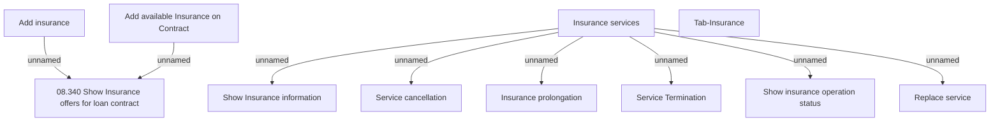

# Tab-Insurance

- **Diagram Type**: Custom
- **Package**: HomerSelect/BSL/Analysis Model/Contract Management/Contract detail/Show contract detail/User Interface Model/Tab-Insurance
- **Diagram ID**: 151366
- **Elements**: 11
- **Connectors**: 8

