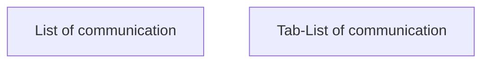

# Tab-List of communication

- **Diagram Type**: Custom
- **Package**: HomerSelect/BSL/Analysis Model/Contract Management/Contract detail/Show contract detail/User Interface Model/Tab-List of communication
- **Diagram ID**: 118759
- **Elements**: 2
- **Connectors**: 0

