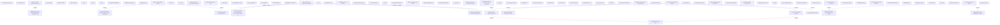

# Tab-Payment channels

```mermaid
graph TD
    Remaining_cash_payment["Remaining cash payment"]
    Trade_in_amount["Trade-in amount"]
    Show_disbursement_channel_change_request["Show disbursement channel change request"]
    Show_address["Show address"]
    Document_number["Document number"]
    Phone_number_1["Phone number 1"]
    Name_1["Name 1"]
    Name_3["Name 3"]
    Name_2["Name 2"]
    ADD_Beneficiary_address["{ADD}Beneficiary address"]
    ADD_Beneficiary_person["{ADD}Beneficiary person"]
    ADD_Target_type["{ADD}Target type"]
    MOD_01_678_Change_repeated_disbursement_channel_via_GUI["{MOD}01.678 Change repeated disbursement channel via GUI"]
    Change_repeated_disbursement_channel["Change repeated disbursement channel"]
    Salesroom["Salesroom"]
    UI_Control["UI Control"]
    Show_Bank_Account_Repeated_Disbursement["Show Bank Account - Repeated Disbursement"]
    Repeated_disbursement_type["Repeated disbursement type"]
    Holder_Name["Holder Name "]
    Repeated_disbursement["Repeated disbursement"]
    Sum_of_prepayments["Sum of prepayments"]
    Truncated_PAN["Truncated PAN"]
    Card_issuer_name["Card issuer name"]
    ADD_External_card_detail["{ADD}External card detail"]
    User_Interface_Model_Rewards_payment_channel_management["User Interface Model : Rewards payment channel management"]
    n_01_669_Change_reward_payment_channel["01.669 Change reward payment channel"]
    Change_reward_payment_channel["Change reward payment channel"]
    Type["Type"]
    ADD_Bank_code["{ADD}Bank code"]
    ADD_Bank_account_number["{ADD}Bank account number"]
    ADD_CEL_reward_channel["{ADD}CEL reward channel"]
    Show_disbursement_channel_change_request["Show disbursement channel change request"]
    User_Interface_Model_Show_disbursement_channel_change_reques["User Interface Model : Show disbursement channel change request - UI"]
    n_01_664_Show_disbursement_channel_change_request["01.664 Show disbursement channel change request"]
    Partner_bank_branch["Partner bank branch"]
    Partner["Partner "]
    Payment_provider_details["Payment provider details"]
    Minimal_installment_fixed_amount["Minimal installment fixed amount"]
    Minimal_installment_rate["Minimal installment rate"]
    Minimal_installment_base["Minimal installment base"]
    Interest_rates["Interest rates"]
    Presented_interest_rate_from_initial_transaction["Presented interest rate from initial transaction"]
    Presented_interest_rate_from_initial_extra_transaction["Presented interest rate from initial + extra transaction"]
    Interests["Interests"]
    Down_payment_amount["Down payment amount"]
    Cash_payment["Cash payment"]
    Customer_first_due_date["Customer first due date"]
    Credit_amount["Credit amount"]
    First_due_date["First due date"]
    Non_revolving_area["Non revolving area"]
    MOD_Business_type_of_loan["{MOD}Business type of loan"]
    n_03_021_Show_REL_installment_schedule["03.021 Show REL installment schedule"]
    Show_Bank_Account["Show Bank Account"]
    Fees_and_services["Fees and services"]
    Credit_limit["Credit limit"]
    Revolving_loan_information["Revolving loan information"]
    Get_allowed_repayment_methods_for_contract["Get allowed repayment methods for contract"]
    MOD_01_473_Show_debt_catalogue_detail["{MOD}01.473 Show debt catalogue detail"]
    n_03_020_Show_installment_schedule["03.020 Show installment schedule"]
    n_01_660_Change_repayment_channel["01.660 Change repayment channel"]
    Installment_schedule["Installment schedule"]
    Debt_catalogue["Debt catalogue"]
    Change_repayment_channel["Change repayment channel"]
    Presented_Interest_Rate["Presented Interest Rate"]
    Presented_Interest_Rate["Presented Interest Rate"]
    Fully_paid_installments_all_installments["Fully paid installments/all installments"]
    Number_of_advanced_EMI["Number of advanced EMI"]
    Installments_without_advance_EMI["Installments without advance EMI"]
    Total_payment_per_credit["Total payment per credit"]
    Annuity["Annuity"]
    Total_monthly_installment["Total monthly installment"]
    Instalment_schedule_type["Instalment schedule type"]
    Annual_interest_rate["Annual interest rate"]
    Cash_consumer_loan_information["Cash/consumer loan information"]
    Total_delinquent_amount["Total delinquent amount"]
    Outstanding_principal["Outstanding principal"]
    Current_DPD_without_with_tolerance["Current DPD without / with tolerance"]
    Debt_catalogue_information["Debt catalogue information"]
    Marketing_action["Marketing action"]
    Repayment_channel["Repayment channel"]
    Product_name["Product name"]
    User_Interface_Model_Change_disbursement_channel["User Interface Model : Change disbursement channel"]
    MOD_01_662_Change_disbursement_channel["{MOD}01.662 Change disbursement channel"]
    Info_label["Info label"]
    Disbursement_channel["Disbursement channel"]
    Change_disbursement_channel["Change disbursement channel"]
    Repayment_channel["Repayment channel"]
    Disbursement_channel["Disbursement channel"]
    Payment_channels["Payment channels"]
    Change_disbursement_channel -->|unnamed| MOD_01_662_Change_disbursement_channel
    Installment_schedule -->|unnamed| n_03_021_Show_REL_installment_schedule
    n_01_660_Change_repayment_channel -->|unnamed| Get_allowed_repayment_methods_for_contract
    Installment_schedule -->|unnamed| n_03_020_Show_installment_schedule
    n_01_660_Change_repayment_channel -->|unnamed| Change_repayment_channel
    Change_disbursement_channel -->|unnamed| User_Interface_Model_Change_disbursement_channel
    Show_disbursement_channel_change_request -->|unnamed| n_01_664_Show_disbursement_channel_change_request
    n_03_021_Show_REL_installment_schedule -->|unnamed| MOD_Business_type_of_loan
    Change_reward_payment_channel -->|unnamed| User_Interface_Model_Rewards_payment_channel_management
    Change_reward_payment_channel -->|unnamed| n_01_669_Change_reward_payment_channel
    Show_disbursement_channel_change_request -->|unnamed| User_Interface_Model_Show_disbursement_channel_change_reques
    Show_disbursement_channel_change_request -->|unnamed| User_Interface_Model_Show_disbursement_channel_change_reques
    Show_disbursement_channel_change_request -->|unnamed| n_01_664_Show_disbursement_channel_change_request
    Change_repeated_disbursement_channel -->|unnamed| MOD_01_678_Change_repeated_disbursement_channel_via_GUI
    n_03_020_Show_installment_schedule -->|unnamed| MOD_Business_type_of_loan
```
