# Tab-Services

- **Diagram Type**: Custom
- **Package**: HomerSelect/BSL/Analysis Model/Contract Management/Contract detail/Show contract detail/User Interface Model/Tab-Services
- **Diagram ID**: 140316
- **Elements**: 40
- **Connectors**: 38

```mermaid
graph TD
    n_08_085_Replace_Contract_Service_manually["08.085 Replace Contract Service manually"]
    MOD_08_095_Cancel_contract_service_manually["{MOD}08.095 Cancel contract service manually"]
    MOD_08_207_Set_Enforce_gift_payment_flag["{MOD}08.207 Set Enforce gift payment flag"]
    User_Interface_Show_or_update_Bundle_service_status["User Interface : Show or update Bundle service status"]
    n_08_300_Show_Bundle_service_status["08.300 Show Bundle service status"]
    Use_case_model_Collection_tools_request["Use case model : Collection tools request"]
    User_Interface_Model_CEL_Reward_preview["User Interface Model : CEL Reward preview"]
    n_08_600_Show_CEL_Rewards_preview["08.600 Show CEL Rewards preview"]
    User_Interface_Service_termination["User Interface : Service termination"]
    n_08_090_Terminate_Contract_Service_manually["08.090 Terminate Contract Service manually"]
    diagram_B4692317_AC74_40ff_87D2_CABE29CBE398["$diagram://{B4692317-AC74-40ff-87D2-CABE29CBE398}"]
    n_08_080_Add_new_available_Service_on_Contract["08.080 Add new available Service on Contract"]
    Add_available_services["Add available services"]
    diagram_ADD_Show_service_operation_status["$diagram:{ADD}Show service operation status"]
    n_08_030_Show_service_operation_status["08.030 Show service operation status"]
    User_Interface_Model_Set_terms_of_loan_fulfillment["User Interface Model : Set terms of loan fulfillment"]
    n_08_408_Set_terms_of_loan_fulfillment["08.408 Set terms of loan fulfillment"]
    Contract_detail_main_screen["Contract detail main screen"]
    n_08_353_Browse_requests_for_services["08.353 Browse requests for services"]
    User_Interface_Model_Collection_tools_overview["User Interface Model : Collection tools overview"]
    n_08_900_Show_available_collection_tools_for_client_s_contra["08.900 Show available collection tools for client's contracts"]
    User_Interface_COP_Early_repayment_preview["User Interface : COP Early repayment preview"]
    User_Interface_Model_Full_Early_Repayment_preview["User Interface Model : Full Early Repayment preview"]
    User_Interface_Model_CET_Early_repayment_preview["User Interface Model : CET Early repayment preview"]
    n_08_270_Show_CET_repayment_preview["08.270 Show CET repayment preview"]
    Partial_early_repayment_preview_Partial_early_repayment_prev["Partial early repayment preview : Partial early repayment preview"]
    User_Interface_Change_Due_Date["User Interface : Change Due Date"]
    MOD_08_060_Change_Due_Date["{MOD}08.060 Change Due Date"]
    n_08_050_Show_Partial_ER_preview["08.050 Show Partial ER preview"]
    n_08_255_Show_Cooling_off_period_repayment_preview["08.255 Show Cooling-off period repayment preview"]
    ER_request_history_screen_ER_request_history["ER request history screen : ER request history"]
    n_03_200_Show_ER_request_history["03.200 Show ER request history"]
    n_03_035_Show_early_repayment_preview["03.035 Show early repayment preview"]
    User_Interface_Show_service_status["User Interface : Show service status"]
    User_Interface_Show_service_information["User Interface : Show service information"]
    n_08_020_Display_status_of_service_on_contract["08.020 Display status of service on contract"]
    n_08_010_Show_service_information["08.010 Show service information"]
    Services["Services"]
    MOD_01_210_Show_contract_detail["{MOD}01.210 Show contract detail"]
    Tab_Services["Tab Services"]
    Services -->|unnamed| n_08_085_Replace_Contract_Service_manually
    ER_request_history_screen_ER_request_history -->|unnamed| n_03_200_Show_ER_request_history
    Services -->|unnamed| n_03_200_Show_ER_request_history
    Services -->|unnamed| n_08_255_Show_Cooling_off_period_repayment_preview
    Services -->|unnamed| n_08_050_Show_Partial_ER_preview
    Services -->|unnamed| MOD_08_060_Change_Due_Date
    MOD_08_060_Change_Due_Date -->|unnamed| User_Interface_Change_Due_Date
    Services -->|unnamed| n_08_270_Show_CET_repayment_preview
    Use_case_model_Collection_tools_request -->|unnamed| n_08_900_Show_available_collection_tools_for_client_s_contra
    Services -->|unnamed| n_08_900_Show_available_collection_tools_for_client_s_contra
    Services -->|unnamed| n_08_900_Show_available_collection_tools_for_client_s_contra
    User_Interface_Model_Collection_tools_overview -->|unnamed| n_08_900_Show_available_collection_tools_for_client_s_contra
    Services -->|unnamed| n_08_353_Browse_requests_for_services
    Services -->|unnamed| MOD_08_095_Cancel_contract_service_manually
    Services -->|unnamed| n_08_300_Show_Bundle_service_status
    User_Interface_Model_Set_terms_of_loan_fulfillment -->|unnamed| n_08_408_Set_terms_of_loan_fulfillment
    Services -->|unnamed| n_08_030_Show_service_operation_status
    Add_available_services -->|unnamed| n_08_080_Add_new_available_Service_on_Contract
    diagram_B4692317_AC74_40ff_87D2_CABE29CBE398 -->|unnamed| n_08_080_Add_new_available_Service_on_Contract
    User_Interface_Service_termination -->|unnamed| n_08_090_Terminate_Contract_Service_manually
    Services -->|unnamed| n_08_090_Terminate_Contract_Service_manually
    Services -->|unnamed| n_03_035_Show_early_repayment_preview
    Services -->|unnamed| n_08_600_Show_CEL_Rewards_preview
    Services -->|unnamed| n_08_408_Set_terms_of_loan_fulfillment
    User_Interface_Show_or_update_Bundle_service_status -->|unnamed| n_08_300_Show_Bundle_service_status
    Services -->|unnamed| MOD_08_207_Set_Enforce_gift_payment_flag
    Contract_detail_main_screen -->|unnamed| Tab_Services
    Tab_Services -->|unnamed| MOD_01_210_Show_contract_detail
    Services -->|unnamed| n_08_010_Show_service_information
    Services -->|unnamed| n_08_020_Display_status_of_service_on_contract
    User_Interface_Model_CEL_Reward_preview -->|unnamed| n_08_600_Show_CEL_Rewards_preview
    n_08_270_Show_CET_repayment_preview -->|unnamed| User_Interface_Model_CET_Early_repayment_preview
    n_08_255_Show_Cooling_off_period_repayment_preview -->|unnamed| User_Interface_COP_Early_repayment_preview
    n_08_050_Show_Partial_ER_preview -->|unnamed| Partial_early_repayment_preview_Partial_early_repayment_prev
    n_08_030_Show_service_operation_status -->|unnamed| diagram_ADD_Show_service_operation_status
    n_08_010_Show_service_information -->|unnamed| User_Interface_Show_service_information
    n_03_035_Show_early_repayment_preview -->|unnamed| User_Interface_Model_Full_Early_Repayment_preview
    n_08_020_Display_status_of_service_on_contract -->|unnamed| User_Interface_Show_service_status
```

