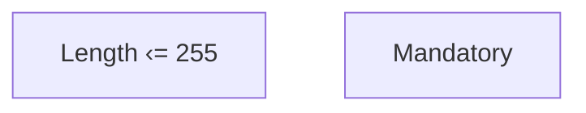

# Validation rules

- **Diagram Type**: Custom
- **Package**: HomerSelect/BSL/Analysis Model/Contract Management/Contract detail/Show contract detail/Validation rules
- **Diagram ID**: 53727
- **Elements**: 2
- **Connectors**: 0

