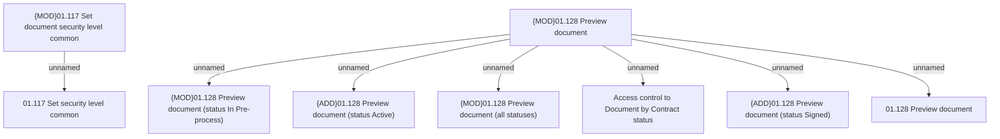

# COMMON for documents

```mermaid
graph TD
    MOD_01_117_Set_document_security_level_common["{MOD}01.117 Set document security level common"]
    n_01_117_Set_security_level_common["01.117 Set security level common"]
    ADD_01_128_Preview_document_status_Active["{ADD}01.128 Preview document (status Active)"]
    ADD_01_128_Preview_document_status_Signed["{ADD}01.128 Preview document (status Signed)"]
    Access_control_to_Document_by_Contract_status["Access control to Document by Contract status"]
    n_01_128_Preview_document["01.128 Preview document"]
    MOD_01_128_Preview_document_status_In_Pre_process["{MOD}01.128 Preview document (status In Pre-process)"]
    MOD_01_128_Preview_document_all_statuses["{MOD}01.128 Preview document (all statuses)"]
    MOD_01_128_Preview_document["{MOD}01.128 Preview document"]
    MOD_01_128_Preview_document -->|unnamed| MOD_01_128_Preview_document_status_In_Pre_process
    MOD_01_128_Preview_document -->|unnamed| ADD_01_128_Preview_document_status_Active
    MOD_01_128_Preview_document -->|unnamed| MOD_01_128_Preview_document_all_statuses
    MOD_01_128_Preview_document -->|unnamed| Access_control_to_Document_by_Contract_status
    MOD_01_128_Preview_document -->|unnamed| ADD_01_128_Preview_document_status_Signed
    MOD_01_128_Preview_document -->|unnamed| n_01_128_Preview_document
    MOD_01_117_Set_document_security_level_common -->|unnamed| n_01_117_Set_security_level_common
```
