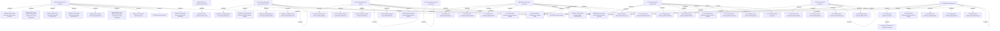

# Client documents - Access Rights

```mermaid
graph TD
    ADD_01_113_Edit_client_document_flag_READ_ONLY["{ADD}01.113 Edit client document (flag READ_ONLY)"]
    n_01_116_Set_client_document_security_level["01.116 Set client document security level"]
    n_01_116_Set_client_document_security_level["01.116 Set client document security level"]
    ADD_01_128_Preview_client_document_with_security_level_2["{ADD}01.128 Preview client document with security level 2"]
    ADD_01_128_Preview_client_document_with_security_level_1["{ADD}01.128 Preview client document with security level 1"]
    ADD_01_128_Preview_client_document_with_security_level_2_fil["{ADD}01.128 Preview client document with security level 2 (file download)"]
    ADD_01_128_Preview_client_document_with_security_level_1_fil["{ADD}01.128 Preview client document with security level 1 (file download)"]
    MOD_01_128_Preview_document_status_In_Pre_process["{MOD}01.128 Preview document (status In Pre-process)"]
    MOD_01_128_Preview_document_all_statuses["{MOD}01.128 Preview document (all statuses)"]
    n_01_128_Preview_document["01.128 Preview document"]
    ADD_01_128_Preview_client_document_file_download["{ADD}01.128 Preview client document (file download)"]
    ADD_01_128_Preview_client_document["{ADD}01.128 Preview client document"]
    MOD_01_128_Preview_document["{MOD}01.128 Preview document"]
    ADD_01_129_Upload_client_document_all_salesrooms["{ADD}01.129 Upload client document (all salesrooms)"]
    ADD_01_129_Upload_client_document_all_statuses["{ADD}01.129 Upload client document (all statuses)"]
    ADD_01_129_Upload_client_document_status_Signed["{ADD}01.129 Upload client document (status Signed)"]
    ADD_01_129_Upload_client_document_statuses_before_signing["{ADD}01.129 Upload client document (statuses before signing)"]
    n_01_106_Add_client_document_common["01.106 Add client document common"]
    ADD_01_106_Add_client_document_common["{ADD}01.106 Add client document common"]
    n_01_129_Take_and_upload_client_document_photo["01.129 Take and upload client document photo"]
    n_01_129_Take_and_upload_client_document_photo["01.129 Take and upload client document photo"]
    n_01_133_Delete_document_content_flag_PHOTO["01.133 Delete document content (flag PHOTO)"]
    n_01_133_Delete_document_content_all_salesrooms["01.133 Delete document content (all salesrooms)"]
    n_01_133_Delete_document_content_all_statuses["01.133 Delete document content (all statuses)"]
    n_01_133_Delete_document_content_statuses_before_signed["01.133 Delete document content (statuses before signed)"]
    n_01_133_Delete_document_content_status_Signed["01.133 Delete document content (status Signed)"]
    n_01_133_Delete_document_content["01.133 Delete document content"]
    n_01_133_Delete_document_content["01.133 Delete document content"]
    MOD_01_105_Set_document_proof_check["{MOD}01.105 Set document proof check"]
    ADD_01_105_Set_document_proof_check["{ADD}01.105 Set document proof check"]
    Access_control_to_Document_by_Salesroom["Access control to Document by Salesroom"]
    n_01_123_Delete_client_document_flag_PHOTO["01.123 Delete client document (flag PHOTO)"]
    n_01_113_Edit_client_document_flag_PHOTO["01.113 Edit client document (flag PHOTO)"]
    n_01_126_Upload_client_document_flag_PHOTO["01.126 Upload client document (flag PHOTO)"]
    MOD_Access_control_to_Document_by_Document_type_flag["{MOD}Access control to Document by Document type flag"]
    Access_control_to_Document_by_Contract_status["Access control to Document by Contract status"]
    n_01_126_Upload_client_document_statuses_before_signing["01.126 Upload client document (statuses before signing)"]
    n_01_126_Upload_client_document_status_Signed["01.126 Upload client document (status Signed)"]
    n_01_123_Delete_client_document_status_Signed["01.123 Delete client document (status Signed)"]
    n_01_113_Edit_client_document_statuses_before_signing["01.113 Edit client document (statuses before signing)"]
    n_01_113_Edit_client_document_status_Signed["01.113 Edit client document (status Signed)"]
    n_01_103_Add_client_document_statuses_before_signing["01.103 Add client document (statuses before signing)"]
    n_01_103_Add_client_document_status_Signed["01.103 Add client document (status Signed)"]
    n_01_126_Upload_client_document_all_statuses["01.126 Upload client document (all statuses)"]
    n_01_126_Upload_client_document_all_salesrooms["01.126 Upload client document (all salesrooms)"]
    n_01_126_Upload_client_document["01.126 Upload client document"]
    n_01_123_Delete_client_document_all_statuses["01.123 Delete client document (all statuses)"]
    n_01_123_Delete_client_document_all_salesrooms["01.123 Delete client document (all salesrooms)"]
    n_01_123_Delete_client_document["01.123 Delete client document"]
    n_01_113_Edit_client_document_all_statuses["01.113 Edit client document(all statuses)"]
    n_01_113_Edit_client_document_all_salesrooms["01.113 Edit client document (all salesrooms)"]
    n_01_113_Edit_client_document["01.113 Edit client document"]
    n_01_103_Add_client_document_all_statuses["01.103 Add client document (all statuses)"]
    n_01_103_Add_client_document_all_salesrooms["01.103 Add client document (all salesrooms)"]
    n_01_103_Add_client_document["01.103 Add client document"]
    n_01_126_Upload_client_document_file["01.126 Upload client document file"]
    n_01_123_Delete_client_document["01.123 Delete client document"]
    MOD_01_113_Edit_client_document["{MOD}01.113 Edit client document"]
    n_01_103_Add_client_document["01.103 Add client document"]
    MOD_01_128_Preview_document -->|unnamed| MOD_01_128_Preview_document_status_In_Pre_process
    MOD_01_128_Preview_document -->|unnamed| ADD_01_128_Preview_client_document_with_security_level_1_fil
    MOD_01_128_Preview_document -->|unnamed| ADD_01_128_Preview_client_document_with_security_level_1
    MOD_01_128_Preview_document -->|unnamed| ADD_01_128_Preview_client_document_with_security_level_2
    MOD_01_128_Preview_document -->|unnamed| MOD_01_128_Preview_document_all_statuses
    MOD_01_128_Preview_document -->|unnamed| Access_control_to_Document_by_Contract_status
    MOD_01_128_Preview_document -->|unnamed| ADD_01_128_Preview_client_document_with_security_level_2_fil
    MOD_01_128_Preview_document -->|unnamed| ADD_01_128_Preview_client_document
    MOD_01_128_Preview_document -->|unnamed| n_01_128_Preview_document
    MOD_01_128_Preview_document -->|unnamed| ADD_01_128_Preview_client_document_file_download
    n_01_116_Set_client_document_security_level -->|unnamed| n_01_116_Set_client_document_security_level
    n_01_106_Add_client_document_common -->|unnamed| ADD_01_106_Add_client_document_common
    n_01_103_Add_client_document -->|unnamed| n_01_106_Add_client_document_common
    n_01_129_Take_and_upload_client_document_photo -->|unnamed| ADD_01_129_Upload_client_document_all_statuses
    n_01_129_Take_and_upload_client_document_photo -->|unnamed| ADD_01_129_Upload_client_document_statuses_before_signing
    n_01_129_Take_and_upload_client_document_photo -->|unnamed| Access_control_to_Document_by_Salesroom
    n_01_129_Take_and_upload_client_document_photo -->|unnamed| ADD_01_129_Upload_client_document_status_Signed
    n_01_129_Take_and_upload_client_document_photo -->|unnamed| ADD_01_129_Upload_client_document_all_salesrooms
    n_01_129_Take_and_upload_client_document_photo -->|unnamed| MOD_Access_control_to_Document_by_Document_type_flag
    n_01_129_Take_and_upload_client_document_photo -->|unnamed| n_01_129_Take_and_upload_client_document_photo
    n_01_129_Take_and_upload_client_document_photo -->|unnamed| Access_control_to_Document_by_Contract_status
    n_01_126_Upload_client_document_file -->|unnamed| Access_control_to_Document_by_Salesroom
    n_01_126_Upload_client_document_file -->|unnamed| MOD_Access_control_to_Document_by_Document_type_flag
    n_01_126_Upload_client_document_file -->|unnamed| n_01_126_Upload_client_document_status_Signed
    n_01_126_Upload_client_document_file -->|unnamed| n_01_126_Upload_client_document_flag_PHOTO
    n_01_126_Upload_client_document_file -->|unnamed| n_01_126_Upload_client_document_statuses_before_signing
    n_01_126_Upload_client_document_file -->|unnamed| n_01_126_Upload_client_document_all_salesrooms
    n_01_126_Upload_client_document_file -->|unnamed| n_01_126_Upload_client_document_all_statuses
    n_01_126_Upload_client_document_file -->|unnamed| Access_control_to_Document_by_Contract_status
    n_01_126_Upload_client_document_file -->|unnamed| n_01_126_Upload_client_document
    n_01_103_Add_client_document -->|unnamed| MOD_Access_control_to_Document_by_Document_type_flag
    n_01_103_Add_client_document -->|unnamed| n_01_103_Add_client_document_statuses_before_signing
    n_01_103_Add_client_document -->|unnamed| n_01_103_Add_client_document_status_Signed
    n_01_103_Add_client_document -->|unnamed| Access_control_to_Document_by_Contract_status
    n_01_103_Add_client_document -->|unnamed| n_01_103_Add_client_document_all_statuses
    n_01_103_Add_client_document -->|unnamed| n_01_103_Add_client_document_all_salesrooms
    n_01_103_Add_client_document -->|unnamed| Access_control_to_Document_by_Salesroom
    n_01_103_Add_client_document -->|unnamed| n_01_103_Add_client_document
    n_01_123_Delete_client_document -->|unnamed| Access_control_to_Document_by_Salesroom
    n_01_123_Delete_client_document -->|unnamed| n_01_123_Delete_client_document_status_Signed
    n_01_123_Delete_client_document -->|unnamed| n_01_123_Delete_client_document_all_statuses
    n_01_123_Delete_client_document -->|unnamed| n_01_123_Delete_client_document_all_salesrooms
    n_01_123_Delete_client_document -->|unnamed| n_01_123_Delete_client_document
    n_01_123_Delete_client_document -->|unnamed| n_01_123_Delete_client_document_flag_PHOTO
    n_01_123_Delete_client_document -->|unnamed| MOD_Access_control_to_Document_by_Document_type_flag
    n_01_123_Delete_client_document -->|unnamed| Access_control_to_Document_by_Contract_status
    MOD_01_105_Set_document_proof_check -->|unnamed| ADD_01_105_Set_document_proof_check
    MOD_01_113_Edit_client_document -->|unnamed| n_01_113_Edit_client_document_all_statuses
    MOD_01_113_Edit_client_document -->|unnamed| n_01_113_Edit_client_document_status_Signed
    MOD_01_113_Edit_client_document -->|unnamed| n_01_113_Edit_client_document_flag_PHOTO
    MOD_01_113_Edit_client_document -->|unnamed| n_01_113_Edit_client_document_statuses_before_signing
    MOD_01_113_Edit_client_document -->|unnamed| MOD_Access_control_to_Document_by_Document_type_flag
    MOD_01_113_Edit_client_document -->|unnamed| n_01_113_Edit_client_document
    MOD_01_113_Edit_client_document -->|unnamed| Access_control_to_Document_by_Contract_status
    MOD_01_113_Edit_client_document -->|unnamed| ADD_01_113_Edit_client_document_flag_READ_ONLY
    MOD_01_113_Edit_client_document -->|unnamed| Access_control_to_Document_by_Salesroom
    MOD_01_113_Edit_client_document -->|unnamed| n_01_113_Edit_client_document_all_salesrooms
    n_01_133_Delete_document_content -->|unnamed| n_01_133_Delete_document_content_status_Signed
    n_01_133_Delete_document_content -->|unnamed| n_01_133_Delete_document_content_all_salesrooms
    n_01_133_Delete_document_content -->|unnamed| n_01_133_Delete_document_content_all_statuses
    n_01_133_Delete_document_content -->|unnamed| n_01_133_Delete_document_content
    n_01_133_Delete_document_content -->|unnamed| n_01_133_Delete_document_content_flag_PHOTO
    n_01_133_Delete_document_content -->|unnamed| MOD_Access_control_to_Document_by_Document_type_flag
    n_01_133_Delete_document_content -->|unnamed| Access_control_to_Document_by_Contract_status
    n_01_133_Delete_document_content -->|unnamed| n_01_133_Delete_document_content_statuses_before_signed
    n_01_133_Delete_document_content -->|unnamed| Access_control_to_Document_by_Salesroom
```
