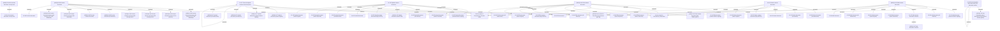

# Contract documents - Access Rights

```mermaid
graph TD
    ADD_01_128_Preview_contract_document_with_security_level_2["{ADD}01.128 Preview contract document with security level 2"]
    ADD_01_128_Preview_contract_document_with_security_level_1["{ADD}01.128 Preview contract document with security level 1"]
    ADD_01_128_Preview_contract_document["{ADD}01.128 Preview contract document"]
    ADD_01_110_Edit_contract_document_flag_READ_ONLY["{ADD}01.110 Edit contract document (flag READ_ONLY)"]
    ADD_01_125_Upload_document_status_Sold["{ADD}01.125 Upload document (status Sold)"]
    MOD_01_114_Set_contract_document_security_level["{MOD}01.114 Set contract document security level"]
    n_01_114_Set_contract_document_security_level["01.114 Set contract document security level"]
    ADD_01_128_Preview_contract_document_with_security_level_2_f["{ADD}01.128 Preview contract document with security level 2 (file download)"]
    ADD_01_128_Preview_contract_document_with_security_level_1_f["{ADD}01.128 Preview contract document with security level 1 (file download)"]
    ADD_01_128_Preview_contract_document_file_download["{ADD}01.128 Preview contract document (file download)"]
    ADD_01_127_Upload_document_all_salesrooms["{ADD}01.127 Upload document (all salesrooms)"]
    ADD_01_127_Upload_document_statuses_before_signing["{ADD}01.127 Upload document (statuses before signing)"]
    ADD_01_127_Upload_document_status_Signed["{ADD}01.127 Upload document (status Signed)"]
    ADD_01_127_Upload_document_all_statuses["{ADD}01.127 Upload document (all statuses)"]
    n_01_127_Take_and_upload_contract_document_photo["01.127 Take and upload contract document photo"]
    MOD_01_128_Preview_document_status_In_Pre_process["{MOD}01.128 Preview document (status In Pre-process)"]
    MOD_01_128_Preview_document["{MOD}01.128 Preview document"]
    MOD_01_128_Preview_document_all_statuses["{MOD}01.128 Preview document (all statuses)"]
    n_01_107_Add_contract_document_common["01.107 Add contract document common"]
    ADD_01_107_Add_document_common["{ADD}01.107 Add document common"]
    n_01_127_Take_and_upload_contract_document_photo["01.127 Take and upload contract document photo"]
    ADD_01_135_Get_information_about_document_from_document_arch["{ADD}01.135 Get information about document from document archive (photo)"]
    n_01_125_Upload_document_status_Rejected["01.125 Upload document (status Rejected)"]
    n_01_125_Upload_document_status_Canceled["01.125 Upload document (status Canceled)"]
    n_01_110_Edit_document_status_Rejected["01.110 Edit document (status Rejected)"]
    n_01_110_Edit_document_status_Canceled["01.110 Edit document (status Canceled)"]
    n_01_100_Add_document_status_Canceled["01.100 Add document (status Canceled)"]
    Access_control_to_Document_by_Salesroom["Access control to Document by Salesroom"]
    n_01_110_Edit_contract_document_flag_PHOTO["01.110 Edit contract document (flag PHOTO)"]
    n_01_125_Upload_contract_document_flag_PHOTO["01.125 Upload contract document (flag PHOTO)"]
    n_01_120_Delete_contract_document_flag_PHOTO["01.120 Delete contract document (flag PHOTO)"]
    MOD_Access_control_to_Document_by_Document_type_flag["{MOD}Access control to Document by Document type flag"]
    n_01_125_Upload_document_statuses_before_signing["01.125 Upload document (statuses before signing)"]
    n_01_125_Upload_document_status_Signed["01.125 Upload document (status Signed)"]
    n_01_120_Delete_document_status_Signed["01.120 Delete document (status Signed)"]
    n_01_110_Edit_document_status_Signed["01.110 Edit document (status Signed)"]
    n_01_110_Edit_document_statuses_before_signing["01.110 Edit document (statuses before signing)"]
    n_01_100_Add_document_status_Signed["01.100 Add document (status Signed)"]
    n_01_100_Add_document_statuses_before_signing["01.100 Add document (statuses before signing)"]
    n_01_135_Get_information_about_document_from_document_archiv["01.135 Get information about document from document archive"]
    n_01_135_Get_information_about_document_from_document_archiv["01.135 Get information about document from document archive"]
    n_01_128_Preview_document["01.128 Preview document"]
    n_01_125_Upload_document_all_statuses["01.125 Upload document (all statuses)"]
    n_01_125_Upload_document_all_salesrooms["01.125 Upload document (all salesrooms)"]
    n_01_125_Upload_document["01.125 Upload document"]
    n_01_120_Delete_document_all_statuses["01.120 Delete document (all statuses)"]
    n_01_120_Delete_document_all_salesrooms["01.120 Delete document (all salesrooms)"]
    n_01_120_Delete_document["01.120 Delete document"]
    n_01_110_Edit_document_all_statuses["01.110 Edit document (all statuses)"]
    n_01_110_Edit_document_all_salesrooms["01.110 Edit document (all salesrooms)"]
    n_01_110_Edit_document["01.110 Edit document"]
    n_01_100_Add_document_all_statuses["01.100 Add document (all statuses)"]
    n_01_100_Add_document_all_salesrooms["01.100 Add document (all salesrooms)"]
    n_01_100_Add_document["01.100 Add document"]
    n_01_125_Upload_contract_document["01.125 Upload contract document"]
    n_01_120_Delete_contract_document["01.120 Delete contract document"]
    MOD_01_110_Edit_contract_document["{MOD}01.110 Edit contract document"]
    MOD_01_100_Add_contract_document["{MOD}01.100 Add contract document"]
    Access_control_to_Document_by_Contract_status["Access control to Document by Contract status"]
    MOD_01_128_Preview_document -->|unnamed| ADD_01_128_Preview_contract_document_with_security_level_1_f
    MOD_01_128_Preview_document -->|unnamed| MOD_01_128_Preview_document_status_In_Pre_process
    MOD_01_128_Preview_document -->|unnamed| ADD_01_128_Preview_contract_document_with_security_level_1
    MOD_01_128_Preview_document -->|unnamed| ADD_01_128_Preview_contract_document_with_security_level_2
    MOD_01_128_Preview_document -->|unnamed| MOD_01_128_Preview_document_all_statuses
    MOD_01_128_Preview_document -->|unnamed| ADD_01_128_Preview_contract_document
    MOD_01_128_Preview_document -->|unnamed| ADD_01_128_Preview_contract_document_file_download
    MOD_01_128_Preview_document -->|unnamed| Access_control_to_Document_by_Contract_status
    MOD_01_128_Preview_document -->|unnamed| ADD_01_128_Preview_contract_document_with_security_level_2_f
    MOD_01_128_Preview_document -->|unnamed| n_01_128_Preview_document
    n_01_125_Upload_contract_document -->|unnamed| n_01_125_Upload_document_statuses_before_signing
    n_01_125_Upload_contract_document -->|unnamed| n_01_125_Upload_document_status_Canceled
    n_01_125_Upload_contract_document -->|unnamed| Access_control_to_Document_by_Contract_status
    n_01_125_Upload_contract_document -->|unnamed| n_01_125_Upload_document_all_statuses
    n_01_125_Upload_contract_document -->|unnamed| ADD_01_125_Upload_document_status_Sold
    n_01_125_Upload_contract_document -->|unnamed| n_01_125_Upload_contract_document_flag_PHOTO
    n_01_125_Upload_contract_document -->|unnamed| n_01_125_Upload_document
    n_01_125_Upload_contract_document -->|unnamed| Access_control_to_Document_by_Salesroom
    n_01_125_Upload_contract_document -->|unnamed| n_01_125_Upload_document_all_salesrooms
    n_01_125_Upload_contract_document -->|unnamed| MOD_Access_control_to_Document_by_Document_type_flag
    n_01_125_Upload_contract_document -->|unnamed| n_01_125_Upload_document_status_Rejected
    n_01_125_Upload_contract_document -->|unnamed| n_01_125_Upload_document_status_Signed
    MOD_01_100_Add_contract_document -->|unnamed| Access_control_to_Document_by_Salesroom
    MOD_01_100_Add_contract_document -->|unnamed| n_01_100_Add_document_statuses_before_signing
    MOD_01_100_Add_contract_document -->|unnamed| n_01_100_Add_document_all_statuses
    MOD_01_100_Add_contract_document -->|unnamed| n_01_107_Add_contract_document_common
    MOD_01_100_Add_contract_document -->|unnamed| n_01_100_Add_document_status_Canceled
    MOD_01_100_Add_contract_document -->|unnamed| Access_control_to_Document_by_Contract_status
    MOD_01_100_Add_contract_document -->|unnamed| n_01_100_Add_document_status_Signed
    MOD_01_100_Add_contract_document -->|unnamed| n_01_100_Add_document_all_salesrooms
    MOD_01_100_Add_contract_document -->|unnamed| MOD_Access_control_to_Document_by_Document_type_flag
    MOD_01_100_Add_contract_document -->|unnamed| n_01_100_Add_document
    n_01_120_Delete_contract_document -->|unnamed| n_01_120_Delete_document_all_salesrooms
    n_01_120_Delete_contract_document -->|unnamed| n_01_120_Delete_document_all_statuses
    n_01_120_Delete_contract_document -->|unnamed| n_01_120_Delete_document
    n_01_120_Delete_contract_document -->|unnamed| MOD_Access_control_to_Document_by_Document_type_flag
    n_01_120_Delete_contract_document -->|unnamed| Access_control_to_Document_by_Salesroom
    n_01_120_Delete_contract_document -->|unnamed| n_01_120_Delete_contract_document_flag_PHOTO
    n_01_120_Delete_contract_document -->|unnamed| n_01_120_Delete_document_status_Signed
    n_01_120_Delete_contract_document -->|unnamed| Access_control_to_Document_by_Contract_status
    MOD_01_114_Set_contract_document_security_level -->|unnamed| n_01_114_Set_contract_document_security_level
    n_01_107_Add_contract_document_common -->|unnamed| ADD_01_107_Add_document_common
    n_01_127_Take_and_upload_contract_document_photo -->|unnamed| Access_control_to_Document_by_Contract_status
    n_01_127_Take_and_upload_contract_document_photo -->|unnamed| Access_control_to_Document_by_Salesroom
    n_01_127_Take_and_upload_contract_document_photo -->|unnamed| ADD_01_127_Upload_document_status_Signed
    n_01_127_Take_and_upload_contract_document_photo -->|unnamed| ADD_01_127_Upload_document_statuses_before_signing
    n_01_127_Take_and_upload_contract_document_photo -->|unnamed| MOD_Access_control_to_Document_by_Document_type_flag
    n_01_127_Take_and_upload_contract_document_photo -->|unnamed| ADD_01_127_Upload_document_all_statuses
    n_01_127_Take_and_upload_contract_document_photo -->|unnamed| n_01_127_Take_and_upload_contract_document_photo
    n_01_127_Take_and_upload_contract_document_photo -->|unnamed| ADD_01_127_Upload_document_all_salesrooms
    n_01_135_Get_information_about_document_from_document_archiv -->|unnamed| ADD_01_135_Get_information_about_document_from_document_arch
    n_01_135_Get_information_about_document_from_document_archiv -->|unnamed| n_01_135_Get_information_about_document_from_document_archiv
    MOD_01_110_Edit_contract_document -->|unnamed| n_01_110_Edit_document_statuses_before_signing
    MOD_01_110_Edit_contract_document -->|unnamed| MOD_Access_control_to_Document_by_Document_type_flag
    MOD_01_110_Edit_contract_document -->|unnamed| Access_control_to_Document_by_Salesroom
    MOD_01_110_Edit_contract_document -->|unnamed| Access_control_to_Document_by_Contract_status
    MOD_01_110_Edit_contract_document -->|unnamed| ADD_01_110_Edit_contract_document_flag_READ_ONLY
    MOD_01_110_Edit_contract_document -->|unnamed| n_01_110_Edit_document_status_Canceled
    MOD_01_110_Edit_contract_document -->|unnamed| n_01_110_Edit_document_status_Rejected
    MOD_01_110_Edit_contract_document -->|unnamed| n_01_110_Edit_document_all_statuses
    MOD_01_110_Edit_contract_document -->|unnamed| n_01_110_Edit_document
    MOD_01_110_Edit_contract_document -->|unnamed| n_01_110_Edit_contract_document_flag_PHOTO
    MOD_01_110_Edit_contract_document -->|unnamed| n_01_110_Edit_document_status_Signed
    MOD_01_110_Edit_contract_document -->|unnamed| n_01_110_Edit_document_all_salesrooms
```
