# DDM documents - Access Rights

- **Diagram Type**: Custom
- **Package**: HomerSelect/BSL/Analysis Model/Contract Management/Contract documents management/Access Rights/DDM documents
- **Diagram ID**: 125410
- **Elements**: 20
- **Connectors**: 21

```mermaid
graph TD
    MOD_01_128_Preview_document_file_download["{MOD}01.128 Preview document (file download)"]
    MOD_01_128_Preview_document["{MOD}01.128 Preview document"]
    n_01_108_Add_DDM_document_common["01.108 Add DDM document common"]
    ADD_01_108_Add_DDM_document_common["{ADD}01.108 Add DDM document common"]
    Access_control_to_Document_by_Salesroom["Access control to Document by Salesroom"]
    n_01_122_Delete_DDM_document_statuses_before_signing["01.122 Delete DDM document (statuses before signing)"]
    n_01_112_Edit_DDM_document_statuses_before_signing["01.112 Edit DDM document (statuses before signing)"]
    Access_control_to_Document_by_Contract_status["Access control to Document by Contract status"]
    n_01_122_Delete_DDM_document_all_salesrooms["01.122 Delete DDM document (all salesrooms)"]
    n_01_122_Delete_DDM_document_all_statuses["01.122 Delete DDM document (all statuses)"]
    n_01_122_Delete_DDM_document["01.122 Delete DDM document"]
    n_01_112_Edit_DDM_document_all_salesrooms["01.112 Edit DDM document (all salesrooms)"]
    n_01_112_Edit_DDM_document_all_statuses["01.112 Edit DDM document (all statuses)"]
    n_01_112_Edit_DDM_document["01.112 Edit DDM document"]
    n_01_102_Add_DDM_document_all_salesrooms["01.102 Add DDM document (all salesrooms)"]
    n_01_102_Add_DDM_document_all_statuses["01.102 Add DDM document (all statuses)"]
    n_01_102_Add_DDM_document["01.102 Add DDM document"]
    n_01_122_Delete_DDM_document["01.122 Delete DDM document"]
    n_01_112_Edit_DDM_document["01.112 Edit DDM document"]
    n_01_102_Add_DDM_document["01.102 Add DDM document"]
    MOD_01_128_Preview_document -->|unnamed| MOD_01_128_Preview_document_file_download
    MOD_01_128_Preview_document -->|unnamed| Access_control_to_Document_by_Contract_status
    n_01_108_Add_DDM_document_common -->|unnamed| ADD_01_108_Add_DDM_document_common
    n_01_102_Add_DDM_document -->|unnamed| n_01_108_Add_DDM_document_common
    n_01_112_Edit_DDM_document -->|unnamed| n_01_112_Edit_DDM_document_all_statuses
    n_01_112_Edit_DDM_document -->|unnamed| n_01_112_Edit_DDM_document_all_salesrooms
    n_01_112_Edit_DDM_document -->|unnamed| n_01_112_Edit_DDM_document
    n_01_112_Edit_DDM_document -->|unnamed| n_01_112_Edit_DDM_document_statuses_before_signing
    n_01_112_Edit_DDM_document -->|unnamed| Access_control_to_Document_by_Salesroom
    n_01_112_Edit_DDM_document -->|unnamed| Access_control_to_Document_by_Contract_status
    n_01_122_Delete_DDM_document -->|unnamed| Access_control_to_Document_by_Contract_status
    n_01_122_Delete_DDM_document -->|unnamed| n_01_122_Delete_DDM_document_all_statuses
    n_01_122_Delete_DDM_document -->|unnamed| n_01_122_Delete_DDM_document
    n_01_122_Delete_DDM_document -->|unnamed| n_01_122_Delete_DDM_document_all_salesrooms
    n_01_122_Delete_DDM_document -->|unnamed| n_01_122_Delete_DDM_document_statuses_before_signing
    n_01_122_Delete_DDM_document -->|unnamed| Access_control_to_Document_by_Salesroom
    n_01_102_Add_DDM_document -->|unnamed| Access_control_to_Document_by_Contract_status
    n_01_102_Add_DDM_document -->|unnamed| n_01_102_Add_DDM_document
    n_01_102_Add_DDM_document -->|unnamed| n_01_102_Add_DDM_document_all_statuses
    n_01_102_Add_DDM_document -->|unnamed| n_01_102_Add_DDM_document_all_salesrooms
    n_01_102_Add_DDM_document -->|unnamed| Access_control_to_Document_by_Salesroom
```

