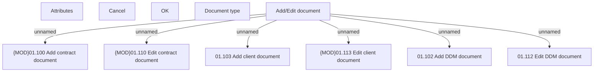

# Add/Edit document

```mermaid
graph TD
    n_01_112_Edit_DDM_document["01.112 Edit DDM document"]
    n_01_102_Add_DDM_document["01.102 Add DDM document"]
    MOD_01_113_Edit_client_document["{MOD}01.113 Edit client document"]
    n_01_103_Add_client_document["01.103 Add client document"]
    Attributes["Attributes"]
    MOD_01_110_Edit_contract_document["{MOD}01.110 Edit contract document"]
    MOD_01_100_Add_contract_document["{MOD}01.100 Add contract document"]
    Cancel["Cancel"]
    OK["OK"]
    Document_type["Document type"]
    Add_Edit_document["Add/Edit document"]
    Add_Edit_document -->|unnamed| MOD_01_100_Add_contract_document
    Add_Edit_document -->|unnamed| MOD_01_110_Edit_contract_document
    Add_Edit_document -->|unnamed| n_01_103_Add_client_document
    Add_Edit_document -->|unnamed| MOD_01_113_Edit_client_document
    Add_Edit_document -->|unnamed| n_01_102_Add_DDM_document
    Add_Edit_document -->|unnamed| n_01_112_Edit_DDM_document
```
