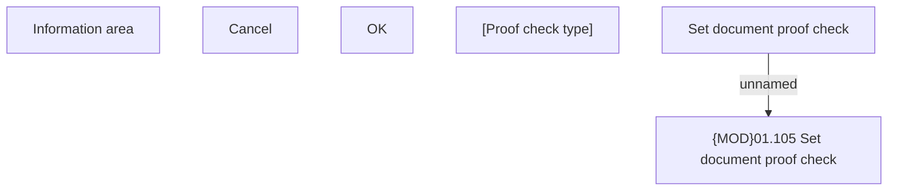

# Set document proof check - user interface model

```mermaid
graph TD
    Information_area["Information area"]
    MOD_01_105_Set_document_proof_check["{MOD}01.105 Set document proof check"]
    Cancel["Cancel"]
    OK["OK"]
    Proof_check_type["[Proof check type]"]
    Set_document_proof_check["Set document proof check"]
    Set_document_proof_check -->|unnamed| MOD_01_105_Set_document_proof_check
```
