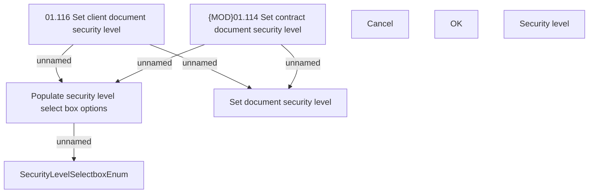

# Set document security level

```mermaid
graph TD
    MOD_01_114_Set_contract_document_security_level["{MOD}01.114 Set contract document security level"]
    Populate_security_level_select_box_options["Populate security level select box options"]
    n_01_116_Set_client_document_security_level["01.116 Set client document security level"]
    SecurityLevelSelectboxEnum["SecurityLevelSelectboxEnum"]
    Cancel["Cancel"]
    OK["OK"]
    Security_level["Security level"]
    Set_document_security_level["Set document security level"]
    n_01_116_Set_client_document_security_level -->|unnamed| Populate_security_level_select_box_options
    n_01_116_Set_client_document_security_level -->|unnamed| Set_document_security_level
    MOD_01_114_Set_contract_document_security_level -->|unnamed| Populate_security_level_select_box_options
    MOD_01_114_Set_contract_document_security_level -->|unnamed| Set_document_security_level
    Populate_security_level_select_box_options -->|unnamed| SecurityLevelSelectboxEnum
```
