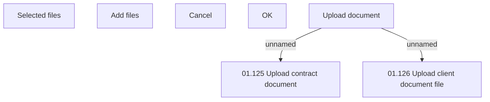

# Upload document

```mermaid
graph TD
    n_01_126_Upload_client_document_file["01.126 Upload client document file"]
    Selected_files["Selected files"]
    Add_files["Add files"]
    n_01_125_Upload_contract_document["01.125 Upload contract document"]
    Cancel["Cancel"]
    OK["OK"]
    Upload_document["Upload document"]
    Upload_document -->|unnamed| n_01_125_Upload_contract_document
    Upload_document -->|unnamed| n_01_126_Upload_client_document_file
```
